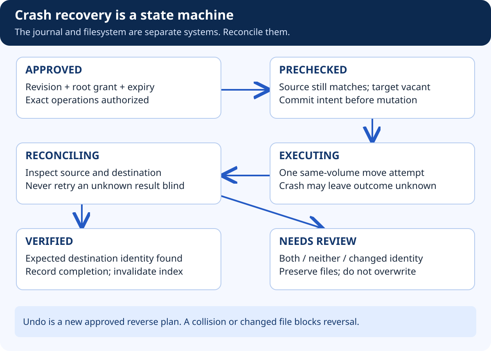

# Build FilePilot — Approved Operations and Crash Recovery

## At a glance

Implement one ordinary-file, same-volume move before attempting any batch feature. The engine loads a persisted approved plan, checks current conditions, records intent, attempts the operation through a reviewed adapter, verifies the outcome, and records completion. A crash can happen between any two of those steps.

## What the diagram teaches



The most dangerous assumption is that “the database says unfinished” means “the file did not move.” Consider this sequence: the engine commits an intent record, moves the file, and crashes before recording completion. On restart, the destination may already contain the expected file. Retrying as though nothing happened is incorrect.

The opposite assumption is also dangerous. A destination with the expected name might belong to another program or contain different bytes. Recovery must inspect the expected source identity, destination identity, content fingerprint, and journal—not simply check whether a filename exists.

## 1. Create the storage and services

Create `storage/database.py` and a migration for plans, approvals, jobs, and operation events. Use explicit transactions for claims and state transitions. Create a unique key for one logical execution request, and reject reuse of that key with a different plan digest.

In `approvals.py`, implement `approve_revision` and `authorize_execution`. Bind approval to the principal, root-grant version, immutable plan revision, selected operations, and expiry. In `operations.py`, implement `claim_job`, `record_intent`, `execute_operation`, and `record_observation`. In `reconciliation.py`, implement `reconcile_operation` and `propose_reverse_plan`.

## 2. Implement the sequence, not a giant helper

```text
Load authoritative plan and approval
→ Claim job with a unique request key
→ Check current grant and approval expiry
→ Inspect current source and destination through adapter
→ Commit operation intent to journal
→ Recheck the supported preconditions at the mutation boundary
→ Attempt one no-overwrite same-volume move
→ Inspect resulting identity and bytes
→ Commit observed result
→ Invalidate old search location
```

This is design pseudocode, not executable Python. A precheck followed by a rename is still subject to filesystem races. The initial exercise is restricted to a controlled sandbox without hostile concurrent writers. A real-file adapter needs OS-specific protections and review; repeated path checks are not a proof of race resistance.

Use a single writer process and ensure restart reconciles any previous in-progress intent before claiming new work for that source. Never use a fallback copy-and-delete operation when the supported move fails. Such a fallback changes the approved operation and the failure model.

## 3. Define reconciliation outcomes

| Observation | Action |
|---|---|
| Source absent, destination has expected identity and bytes | Record verified completion if journal evidence agrees |
| Source unchanged, destination absent | Record a known non-completion; retry only after fresh authorization and policy checks |
| Source and destination both present | Needs review; do not delete either |
| Neither present | Needs review; do not invent a restoration |
| Destination contains different bytes or identity | Collision / ambiguity; preserve it |
| Source changed | Stale operation; a new plan is required |
| Inspection denied or unreliable | Unknown outcome; stop and surface the limitation |

Same bytes alone do not prove that a particular move happened. Preserve identity observations where the platform supports them, and document their limits. A filesystem restored from backup may invalidate assumptions made before a crash.

## 4. Batch behavior

Execute independent operations in a documented order. Stop the batch on the first blocking failure in the initial implementation. Keep already completed operations visible and mark the remainder as not started. Do not label the entire batch rolled back unless verified reverse operations actually occurred.

Approval expiry is checked before each operation. If it expires halfway through a batch, stop before the next operation and request a new approved revision for the remaining work. The current operation may finish; expiry is not a mechanism for undoing a syscall already in progress.

## 5. Undo honestly

Undo creates a new reverse plan for supported completed operations. Check that the moved file still has its expected identity and content, that the original location is vacant, and that the root remains authorized. Reapproval is required. If a user edited the file or occupied the original name, stop for review.

Reverse operations do not restore every external effect. Applications may have cached locations, shortcuts may have broken, and timestamps or metadata may have changed. Permanent deletion is unsupported precisely because this system does not provide a backup-based undelete guarantee.

## Acceptance gate and demonstration

Inject crashes immediately before intent commit, after intent commit, after the move, and after result commit. Restart the process for each fixture. Capture the actual directory state and journal result. Show a successful reconciliation and an ambiguous case that correctly asks for help. Passing only a happy-path move test is not enough.
