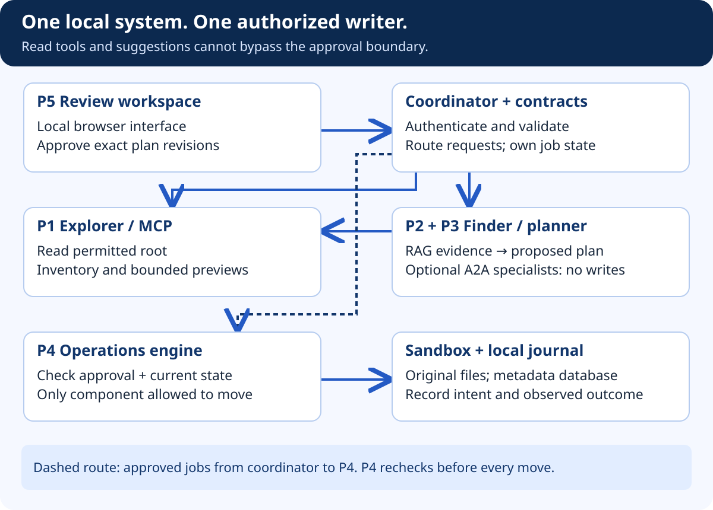

# Build FilePilot — The Human Review Workspace

## At a glance

Build the interface around evidence and decisions, not an unrestricted chat box. The primary screens are root selection, inventory, evidence search, plan review, and operation history. Chat can help formulate a request, but the review screen remains the authority checkpoint.

## What the diagram teaches

Maya asks to organize her notes. The UI should not immediately display a celebratory animation. First it shows the selected root and scan coverage. Then it shows suggestions and unresolved questions. Only after Maya reviews a stable plan does the Execute action become available, and the backend still checks permission independently.

The most useful interface detail is often a precise refusal: “This file changed after you reviewed it. Nothing was moved.” That tells Maya what happened, what did not happen, and how to continue. A vague “Something went wrong” hides all three.

## 1. Build the screens in order

Create `RootGrantPanel.tsx` to display the selected sandbox, permitted operations, and grant status. Do not let ordinary scan requests introduce a new arbitrary root. Root setup should be a separate explicit local action.

Create `FileTable.tsx` for inventory records and skipped entries. Provide keyboard navigation, visible labels, and a clear distinction between filename and file identity. Long names must wrap or have an accessible expanded view. A shortened label should never conceal which item is about to move.

Create `EvidencePanel.tsx` for excerpts and source revisions. Render document text safely as text, not trusted HTML. A file containing script markup should remain readable data, not become executable interface code.

Create `PlanReview.tsx` and `ApprovalSummary.tsx`. For each operation show the current location, proposed destination, evidence, warnings, and supported action. Paths are appropriate inside this future operational UI because the user must know exactly what they approve; the teaching documents themselves should not display authoring-path metadata.

Create `OperationTimeline.tsx` for requested, prechecked, attempted, verified, blocked, and needs-review states. Do not combine unknown and failed into one red badge. Unknown means the outcome must be inspected before another action is safe.

## 2. Treat the plan as a versioned document

If Maya changes a destination or deselects an operation, ask the server for a revised plan. Display its revision before offering approval. A stale browser tab must not approve a newer revision it has never shown. Handle a revision conflict by refreshing the proposal and requiring review.

Keep approval and execution as distinct actions. A button labelled “Approve and run” may eventually be acceptable if it clearly describes both, but the initial teaching UI should expose the separation. This makes the system easier to learn and test.

## 3. Handle connection loss and repeat clicks

Use the server's job ID and status as the source of truth. Disable duplicate submissions for convenience, but rely on server idempotency for correctness. Refreshing the page should retrieve the existing job. Never assume that closing the tab cancels a filesystem operation.

If polling fails, show “Connection lost; operation status unknown” rather than “Failed.” When the connection returns, reload authoritative state. A cancel request should explain whether it stops only operations that have not started; it cannot rewind a completed move.

## 4. Make the interface readable and accessible

Use the library's blue-and-white reading language, clear headings, generous spacing, and high-contrast status labels. Do not rely on color alone. Provide a visible focus indicator, labelled controls, and a concise live region for status changes without announcing every polling response.

On a narrow screen, stack source and destination rather than squeezing a critical approval table into unreadable columns. Allow horizontal scrolling for technical details where necessary. Preserve enough context that a user can still identify the exact proposed change.

## Acceptance gate and demonstration

Test keyboard-only review, narrow-screen layout, stale revision conflicts, expired approvals, duplicate clicks, and connection loss after execution begins. Then call the API directly with an unapproved plan and verify denial. The interface explains the rules; it does not enforce them on its own.
