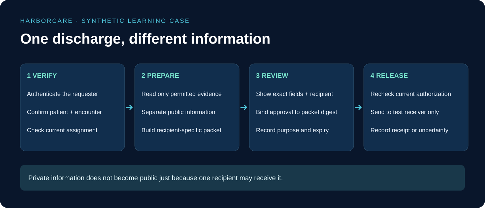

# HarborCare — Project Strategy

## Build a privacy system you can explain, not five disconnected medical chatbots

The proposed platform helps a hospital coordinate a discharge without giving every participant the patient's complete record. The data is synthetic. Its purpose is to demonstrate permission enforcement, evidence handling, agent boundaries, and accountable disclosure—not to diagnose, prescribe, or decide care.

## 1. At a glance

Build one long case study with five independently demonstrable projects. Each project should have its own tests and README, but they share contracts and a fictional patient story. This gives the portfolio depth without duplicating login, storage, and policy code across five repositories.

## 2. The running case

Patient `SYN-P001` has a synthetic discharge encounter `ENC-100` at hospital `HOSP-A`. The assigned clinician coordinates follow-up care. The insurer `ORG-I01` requests a claim packet. The transport provider `ORG-T01` receives an assignment to collect the patient. A similarly named organization `ORG-T99` is not assigned and must be denied.

The transport packet contains a synthetic pickup alias, pickup point, destination, time window, and necessary assistance instructions. It omits diagnosis, medications, test results, insurance identifiers, and the full discharge summary. Those omitted fields do not become safe because an agent says they would be helpful.

A second patient, `SYN-P002`, provides the wrong-patient test. A public visitor can read visiting hours but cannot discover whether either patient is admitted. General hospital information and patient-linked information are separate collections.

## 3. What success looks like

The reviewer sees the intended recipient, purpose, included fields, excluded fields, evidence used for the policy decision, and expiry. They approve a specific packet revision. The dispatcher checks current authority and recipient binding before sending the packet to the test receiver. The audit trail records the decision and outcome without copying clinical text into logs.

Success includes correct denials. A useful demonstration shows an authorized request succeed, a lookalike agency fail, an expired authorization fail, and a queued release stop after revocation. It also shows that the receiver deduplicates the same release when an acknowledgement is lost.

## 4. Divide the work into five projects

| Project | Build first | Extend later | Do not give it |
|---|---|---|---|
| P1 MCP | Recipient-scoped patient view and packet preview | Approved release command and receipt lookup | A generic full-record export tool |
| P2 RAG | Separate policy/public/patient indexes and access filters | Ranked evidence and safe summaries | Authority to invent disclosure policy |
| P3 A2A | Scheduling and transport fixture agents | Claims specialist and validated artifacts | Raw chart access for every agent |
| P4 Workflow | Persisted request, policy decision, approval, outbox | Revocation races and acknowledgement recovery | An assumption that a sent packet can be unsent |
| P5 Workspace | Recipient-specific preview with clear exclusions | Audit views and operator reconciliation | Browser-controlled permissions |

P1 owns disclosure enforcement and packet records. P2 owns evidence versions. Each specialist owns its task and artifact records. P4 owns coordination and approval state. P5 presents authorized views and sends commands. These boundaries remain the same across languages.

## 5. Build the smallest convincing vertical slice

Start with a deterministic field policy and a unit test: an assigned transport provider can receive the approved transport fields, but cannot receive `diagnosis`. Then persist the policy decision and packet. Add the authenticated MCP boundary. Add policy retrieval, then A2A tasks, then a durable review-and-release workflow, then the web interface.

Do not begin with a hospital-wide electronic health record integration. A small synthetic record store makes the safety behavior observable. Introduce a real interoperability adapter only after its mappings, authorization, and vendor requirements have been independently reviewed.

Use deterministic fixture responses first. A live language model is an interchangeable helper for explanations and classification proposals. It is not the security perimeter or the final policy decision-maker.

## 6. Three demonstration modes

**Learning mode:** all services run locally; documents and patients are synthetic; delivery ends at a local receiver. The learner can inspect packet fields and safe audit metadata.

**Portfolio mode:** a hosted demo uses the same synthetic fixtures and restricted accounts. Public visitors can explore general information, while sensitive controls require demo reviewer access and quotas. No arbitrary uploads or arbitrary external destinations.

**Evaluation mode:** automated tests inject wrong recipients, patient substitutions, prompt injections, revoked permissions, and response loss. Record actual outcomes and failures. Never label a target success rate as a measured result.

## 7. What not to build in release one

Exclude clinical advice, automated care prioritization, real claims submission, real messaging, broad chart downloads, emergency override, automatic publication of de-identified records, and real patient consent collection. These features materially expand risk and validation needs.

“Break glass” emergency access is not a shortcut around permissions for a tutorial. A real emergency-access design needs a defined legal/clinical basis, restricted identities, monitoring, and retrospective review. This demo instead denies out-of-scope emergency claims and directs them to a human process.

## 8. Portfolio evidence

Save test reports showing exact permitted fields, denied fields, policy versions, recipient IDs, and synthetic release receipts. Capture screenshots using fictional names. Publish a threat-model summary and limitations. Keep sensitive-looking fixture labels obviously synthetic to reduce confusion.

Explain the project like this: **“We built an agent-assisted discharge workflow that checks who may receive which fields, prevents unauthorized data from reaching retrieval and agents, and records each permitted disclosure.”**
