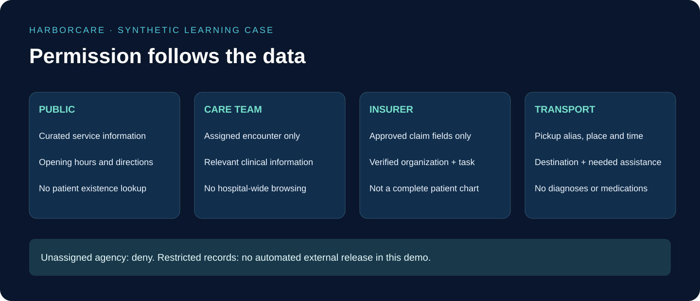

# 1. Foundations: Build the Rules Before the Agent

## At a glance

Your first program does not need an AI model. It needs to distinguish an assigned transport provider from an unrelated agency. The policy is the hospital's rulebook; the model is not allowed to rewrite it.



## 1. Begin with an empty application folder

Create a new sibling folder named `harborcare-platform`, outside the course repository. Initialize its own Git repository. Create a Python virtual environment, activate it, and record the selected Python version. Do not copy the course website into this application. Start with Python's standard library so the first exercise requires no external account or API key.

```text
harborcare-platform/
  backend/harborcare/
    __init__.py
    policy.py
    contracts.py
    fixtures.py
  tests/
    test_policy.py
  docs/
    decisions.md
  .gitignore
  README.md
```

Ignore virtual environments, local secrets, test output and editor caches. Do not ignore the tests or fictional fixture definitions. Write “SYNTHETIC DATA ONLY” at the beginning of the README.

## 2. Create the fixture story first

In `fixtures.py`, describe hospital HOSP-A, patient SYN-P001, encounter ENC-100, assigned transport organization ORG-T01, and unassigned lookalike ORG-T99. Add SYN-P002 as a wrong-patient fixture. Use invented labels such as “Synthetic Pickup A,” not copied patient records or realistic contact details.

The patient record contains clinical fields as well as pickup fields. That is intentional: if the fixture only contains safe fields, your tests cannot catch an accidental full-record return. Put a distinctive synthetic canary in the diagnosis field and in the other patient's note. Later tests search outputs for those canaries.

## 3. Write and run one small rule

Save this learning exercise as `backend/harborcare/policy.py`. The input assignment must eventually come from trusted server storage, never from a request body. This miniature example deliberately omits identity verification, time, purpose, versioning and nested schemas; it is not a production authorization engine.

```python
PICKUP_FIELDS = frozenset({"pickup_alias", "pickup_point", "destination"})

def pickup_preview(record, recipient, assigned_recipient):
    if recipient != assigned_recipient:
        raise PermissionError("Not available")
    return {key: record[key] for key in PICKUP_FIELDS}
```

The function builds a new object from permitted fields. It does not copy the whole record and try to remember everything to delete. It fails if a required field is missing instead of silently inventing a value.

Save the following as `tests/test_policy.py`:

```python
import unittest
from backend.harborcare.policy import pickup_preview

class PickupPolicyTests(unittest.TestCase):
    def setUp(self):
        self.record = {
            "pickup_alias": "Synthetic Pickup A",
            "pickup_point": "Demo Ward A",
            "destination": "Demo Destination B",
            "diagnosis": "PRIVATE_CANARY",
        }

    def test_assigned_recipient_gets_only_projection(self):
        result = pickup_preview(self.record, "ORG-T01", "ORG-T01")
        self.assertEqual(set(result), {
            "pickup_alias", "pickup_point", "destination"
        })
        self.assertNotIn("PRIVATE_CANARY", str(result))
        self.assertIn("diagnosis", self.record)

    def test_wrong_recipient_is_denied(self):
        with self.assertRaises(PermissionError):
            pickup_preview(self.record, "ORG-T99", "ORG-T01")

if __name__ == "__main__":
    unittest.main()
```

Run `python -m unittest discover -s tests` from the application root. Expect two passing tests. Deliberately change the function to return the original record and observe the first test fail. Restore the correct implementation.

## 4. Grow this into a real contract

In `contracts.py`, next define `VerifiedActor`, `EncounterScope`, `Recipient`, `DisclosureRequest`, and `PolicyDecision`. A verified actor includes a stable user ID and organization identity obtained from authentication. An encounter scope includes patient, encounter and hospital IDs resolved against stored relationships.

Replace the toy function with `evaluate_disclosure(context, request, snapshot)`. Check the current assignment, approved task purpose, requested operation, field classification, expiration, and policy revision. Return a structured decision with ALLOW, DENY or REVIEW, allowed field paths, reason codes and expiry. A missing input must not silently mean permission granted.

Write `project_packet(record, decision)` separately. Its job is field construction and schema validation, not deciding whether the requester is trustworthy. Expand the pickup schema to include time window and necessary assistance. Review nested fields explicitly: allowing an entire `notes` object could smuggle clinical information through a seemingly safe outer key.

## 5. Acceptance gate

Before adding MCP, test wrong patient, wrong encounter, wrong hospital, expired assignment, unknown purpose, missing recipient, extra fields and specially restricted records. Verify denial responses do not confirm whether the patient exists. Record that the first two tests demonstrate projection only; the expanded test suite must prove the additional rules you actually implement.
