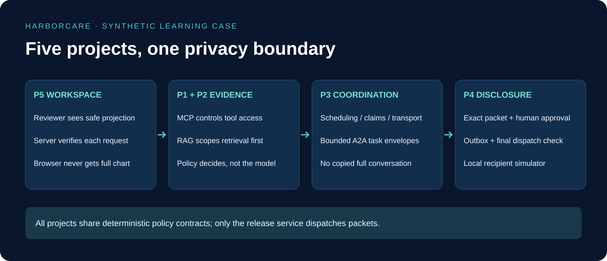

# 4. P3: A2A Care Coordination

## At a glance

Agent-to-agent communication lets specialists collaborate. Think of a care coordinator asking a transport desk to arrange a pickup. The desk needs a bounded task, not a photocopy of every conversation and clinical record.

## 1. Define task envelopes before agents

Create `coordination/contracts.py`. Define a task ID, parent task ID, hospital and encounter scope, sender identity, intended receiving service, purpose code, expiry, policy revision, allowed operations, and a typed payload. Avoid a generic `context: any` field into which someone can drop a full chart.

The envelope's claims must be checked against server-side identity and assignment. A caller cannot grant itself a broader scope by editing the JSON. A capability description tells you what a service offers; it does not prove that this caller may use it.

## 2. Write three deterministic specialists

Create `agents/scheduling.py` with `propose_slot`, `agents/claims.py` with `prepare_claim_fields`, and `agents/transport.py` with `prepare_pickup_plan`. Initially these are plain functions using synthetic fixtures. They return suggestions and status, not external transmissions.

Scheduling receives available synthetic windows and authorized logistical constraints. Claims receives only the policy-approved claim inputs. Transport receives the permitted pickup projection. Do not pass a diagnosis to transport merely because the claims specialist required it for its distinct task.

Test the functions without a coordinator first. This makes failures understandable: you can distinguish a specialist's schema error from a delegation or authorization error.

## 3. Add the coordinator

Create `coordination/coordinator.py` with `plan_tasks`, `build_task_envelope`, and `accept_task_result`. `plan_tasks` maps an approved discharge request into explicit tasks. `build_task_envelope` applies policy separately for each receiving service. `accept_task_result` verifies task identity, sender, schema, expiry and the still-current relationship before using a result.

Not all work can run in parallel. A transport request may depend on the chosen pickup window. Claims preparation may run independently if its inputs and permissions are already available. Express dependencies explicitly instead of asking agents to negotiate them indefinitely.

## 4. Introduce the network protocol

Wrap each specialist in an A2A adapter only after the local contracts pass tests. Choose and pin the current official SDK at implementation time. Test agent discovery, authenticated task creation, status updates, cancellation and result retrieval against that version. Do not invent protocol fields based on the teaching envelope; map your domain contract into the SDK's supported structures.

The receiving service validates the caller and task scope again. A private network is not a substitute for authorization. Reject arbitrary callback destinations and route completion notifications through registered, authenticated channels. Status messages should carry identifiers and state, not full private payloads.

## 5. Walk through a failure

The coordinator dispatches a transport-planning task for ORG-T01. Before the result returns, the assignment changes. The old result may be internally stored under protected access for investigation, but it must not authorize a new disclosure. Mark the plan stale and require recalculation under the new relationship.

If the claims specialist times out, do not substitute the full chart into a transport task to “keep things moving.” Retry only within the original task's permission and expiry. A retry must keep a stable task identity so duplicate completion messages do not create duplicate release requests.

## 6. Acceptance gate

Add `tests/test_agent_boundaries.py`. Capture every outbound task and assert its exact allowed field set. Inject a result from the wrong service, an expired task, an oversized payload, a duplicate result, a changed recipient, and a malicious instruction embedded in source text. None may bypass the disclosure service.

Your demonstration is complete when the coordinator visibly combines safe specialist results while the raw transport task contains no clinical canary. A2A coordinates preparation; P4 still owns permission to release.
