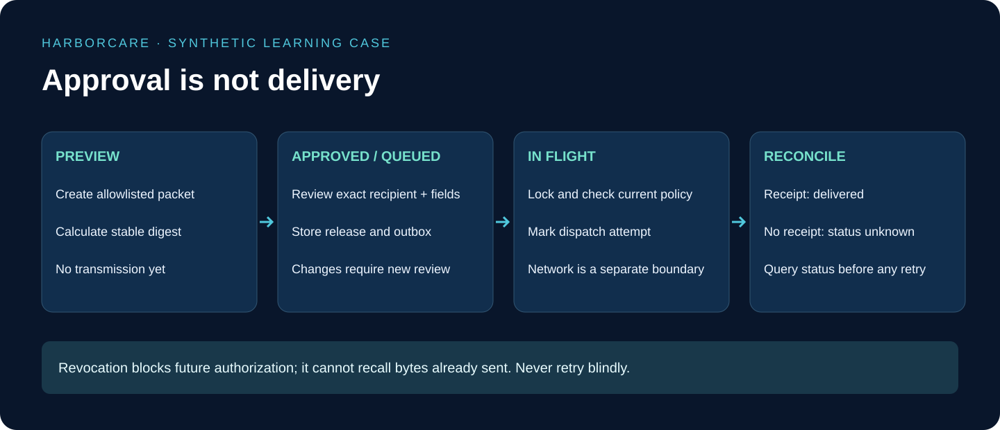

# 7. Operate a Production-Style Synthetic Demo

## At a glance

Production-style means repeatable builds, controlled access, observed failures and tested recovery. It does not mean this teaching application is approved to handle real patients. Keep synthetic-only operation as a technical restriction as well as a written warning.

## 1. Define the deployment units

Keep one Python/hybrid application repository with a web application, backend API, workers, test receiver and shared contracts. They may run as separate processes or deployment services. A separate process is not automatically a separate Git repository.

Create `ops/environment-matrix.md`, `ops/runbook.md`, `ops/restore-checklist.md` and CI workflow files. Record which component owns migrations, which worker sends packets, and which operator can pause it. Never run two independent release systems against the same live outbox accidentally.

## 2. Separate environments before deploying

Use local, test and portfolio-demo environments with separate databases, credentials and recipient registries. Preview deployments get only generated fixtures and simulator destinations. Do not share writable production resources with a branch preview.

Store secrets in the chosen platform's secret mechanism, not Git or screenshots. Give the web application only the service access it needs. Give the worker only the release and receiver permissions it needs. Document rotation and revocation procedures and test that expired credentials fail safely.

## 3. Create the CI gates

Run formatting, type checks, unit tests, schema tests, authorization integration tests and the frontend build. Add secret scanning and dependency review. Run the negative privacy cases against the deployed test services, including searches for canaries in captured model inputs and browser responses.

Require schema migrations to succeed in a disposable test database. For incompatible changes, plan an expand-and-contract migration rather than assuming old workers instantly disappear. Prevent deployment if the policy contract version or receiver contract is incompatible with the running services.

## 4. Deploy in a controlled order

Provision isolated storage and identity configuration. Apply compatible migrations. Deploy the API with outbound delivery disabled. Deploy the receiver simulator and verify its authenticated receipt behavior. Deploy workers paused, then the workspace. Run a synthetic smoke test, inspect evidence, and only then enable the demo dispatcher.

Verify the selected hosting products support the actual worker lifetime, networking and persistence you need. A web request handler should not be assumed to keep running indefinitely after returning a response. Choose a durable job/workflow service or appropriate worker host and test restart behavior there.

## 5. Monitor decisions, not patient payloads

Track counts and latency for authorization denials, stale reviews, queue age, delivery unknown states and receiver conflicts. Record correlation identifiers under protected access. Keep ordinary telemetry separate from the more restricted audit store. Do not send raw prompts, chart excerpts or packet bodies to a general analytics tool.

Define alerts with an operator action. “Delivery unknown” should lead to receipt reconciliation, not a script that retries every packet. “Policy store unavailable” should pause protected operations, not activate a permissive fallback.

## 6. Rehearse rollback and restore

A code rollback cannot undo a disclosed packet. Pause dispatch first when investigating a possible privacy failure. Preserve relevant protected evidence, identify affected synthetic releases and determine whether the receiver accepted them. Follow the organization's incident process before ever considering real-data operation.

Restore a backup into an isolated environment with outbound delivery disabled before workers start. An old backup can contain queued releases whose real-world status changed after the backup. Reconcile them against receiver receipts and current authorization before enabling any new attempt. Test this explicitly; merely restoring database rows is not successful recovery.

## 7. Graduation evidence

Save a build identifier, dependency lockfiles, test report, architecture version, environment inventory, synthetic demo script and restore rehearsal result. Label unimplemented features honestly. The final demonstration should show the correct transport projection, wrong-agency denial, wrong-patient retrieval exclusion, revoked queued release, and lost-acknowledgment recovery.

Before any real patient information is considered, obtain organization-specific legal, security, clinical and vendor review, including appropriate agreements and operational controls. These workbooks are engineering education, not a compliance certification or medical workflow approval.
