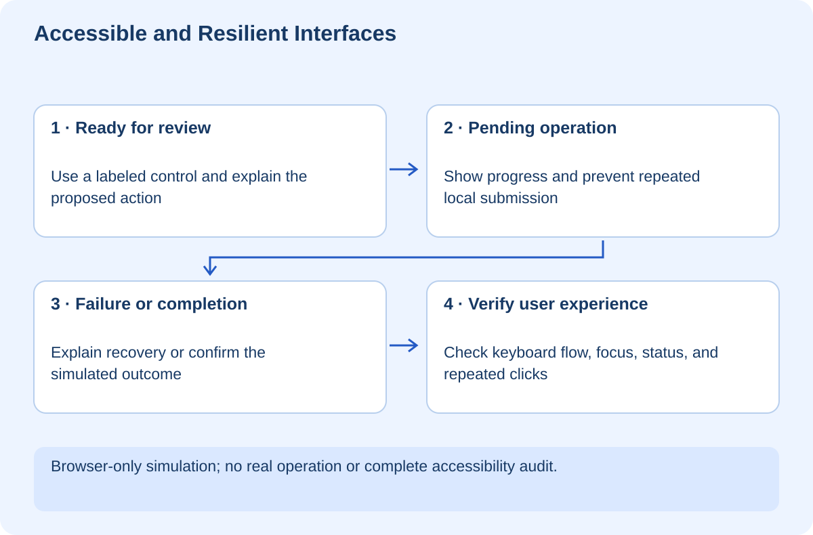

# Accessible and Resilient Interfaces

## At a glance

This workshop teaches you to design a page for people using keyboards, assistive technology, slow connections, and imperfect workflows. The supplied one-page approval simulator demonstrates clear labels, visible focus, pending state, a recoverable failure, and prevention of repeated submission within that page session. It performs no real file operation or network request.

Open `exercises/interface-lab/index.html` in a browser. No build or account is required. The half-second delay is a simulation, not evidence of actual network behavior. The exercise does not claim complete accessibility conformance or backend authorization.

## Lesson 1 — Design the state, not just the happy screenshot

Imagine a user approves a FilePilot proposal and nothing visibly happens. They click again. Did the first request fail, is it still processing, or did it finish without feedback? A beautiful button is not enough when the state is ambiguous.

Define the states before implementation. Ready means the action is available. Pending means the outcome is not known yet. Failed means the user needs useful recovery guidance. Completed means the intended operation finished and should not be casually repeated.

In the simulator, the action button becomes disabled while pending. The status text announces progress, then success or a retry instruction. A counter shows completed simulated operations. This is client-side interaction discipline, not a server-side idempotency guarantee.

## Lesson 2 — Use controls with built-in meaning

The action is a real button, not a clickable div. The checkbox has a label. Native controls provide useful keyboard and accessibility behavior that custom elements often have to recreate.

Use Tab to move through controls. You should see a focus outline. Use Space to change the checkbox and activate the focused button. Do not remove focus indicators just because a mouse user does not need them.

Labels identify controls; placeholder text alone is not a durable label. Instructions should explain the effect before the user commits to an action. For a real approval page, display the exact proposal and its consequences, not merely a vague “Continue.” [W3C's forms tutorial](https://www.w3.org/WAI/tutorials/forms/)

**Checkpoint:** Complete the entire simulated flow without using the mouse.

## Lesson 3 — Make failure recoverable

Check “Simulate a failed response” and activate the button. The page first shows pending, then explains how to retry. Clear the checkbox and retry. The counter should become one, not two.

An error message should explain what happened and what the user can do next without exposing technical secrets. “Error 0x17” gives most users no path forward. “Your approval could not be confirmed; review the current status before retrying” may be more appropriate when a real operation's outcome is uncertain.

The lab's simulated failure is known not to have performed an action. A real timeout may be ambiguous. Do not promise that a retry is safe unless the backend supports that guarantee.

Status changes use a polite live region so assistive technology can announce them without relying only on color. Actual announcement behavior should be tested with the assistive technologies you support. The presence of an ARIA attribute alone is not sufficient verification. [W3C notification guidance](https://www.w3.org/WAI/tutorials/forms/notifications/)

## Lesson 4 — Distinguish UI protection from service protection

The `busy` guard and disabled button prevent ordinary repeated interaction in this page. Another browser tab, direct API caller, or modified client can bypass them. Server-side permissions and duplicate-operation protection remain necessary.

Similarly, a hidden button does not protect an endpoint, and a visible success message does not prove that data was stored. The interface should reflect authoritative service state, not invent it because a timer elapsed. This lab uses a timer only to teach the visible state transitions.

Read the click handler: guard, mark busy, disable, simulate wait, handle outcome, clear busy. The order matters. Setting the guard after awaiting would leave a window for duplicate clicks.

## Lesson 5 — Verify beyond one screen size

Zoom the page and narrow the browser. Check that labels remain readable and controls do not require horizontal page scrolling. Inspect long messages and error states, not only the initial view. Do not use color as the sole indicator of success or failure.

Automated checks can find some structural problems, but human keyboard testing and assistive-technology evaluation still matter. Likewise, screenshots can show layout but cannot prove focus order or announcements.

Record which checks were actually performed. “Accessible” should not be a blanket label attached after adding a label tag. State the tested interactions and remaining gaps.

## Lesson 6 — Your independent challenge

Add a cancel control for the pending simulation. First define whether cancel stops work, hides feedback, or requests cancellation. A real running operation may already have side effects, so your wording must not promise an undo you cannot provide.

Then add a summary of the synthetic proposal and a final confirmation step. Test keyboard order, focus visibility, recovery, and repeat submission. Keep the simulator separate from real FilePilot actions.

Your evidence is a keyboard-completed failure/retry flow and a single successful simulated operation. This workshop supplies a browser exercise, not a production approval service or a complete accessibility audit.
