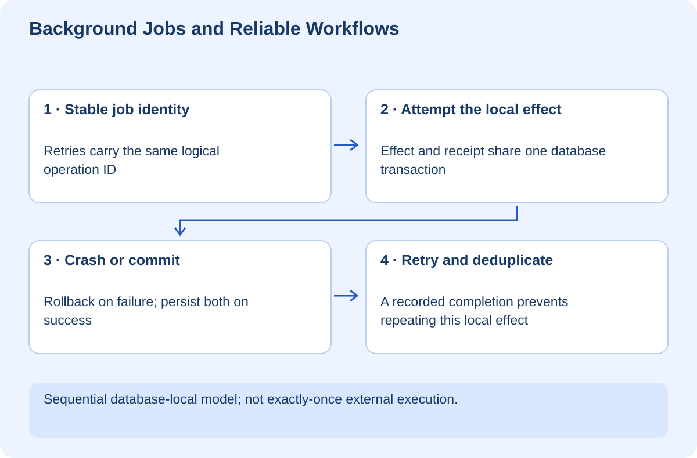

# Background Jobs and Reliable Workflows

## At a glance

This workshop teaches you to reason about work that outlives a single web request. You will distinguish accepting a job from completing it, simulate a crash, retry safely within a database boundary, and explain why duplicate delivery is normal. The runnable Python/SQLite model has no external side effects and uses an in-memory database.

Run `python lab.py` from `exercises`. The script verifies rollback and deduplication for a database-local effect. It does not implement a production queue, multiple workers, or exactly-once email/file operations.

## Lesson 1 — Separate the request from the work

Imagine importing a large collection of documents for RAG. A browser request should not need to remain open for the entire indexing process. The server can validate the request, create a job, and return a job identifier. A worker performs the work and records progress.

The response “accepted” means the system took responsibility for processing; it does not mean the documents are searchable yet. The interface needs states such as queued, running, completed, and failed. It also needs a way to retrieve the current state after a refresh.

A queue transports work. A worker executes it. A job record captures state and outcome. These are related responsibilities, not necessarily one database table or one service.

**Checkpoint:** Explain what the user should see when the request succeeds but the worker later fails.

## Lesson 2 — Expect duplicate delivery

A worker may finish its effect and lose its connection before acknowledging the message. The queue cannot know with certainty whether the work happened, so it may deliver again. Retrying without understanding this boundary can send duplicate emails, charge twice, or repeat a file move.

An idempotency key identifies the logical operation, not each retry attempt. If every retry creates a fresh key, the system cannot recognize it as the same requested work. Decide how the key relates to the user, operation, and input; avoid accidental collisions between distinct jobs.

Our lab uses `task-1` as a stable identity. A receipts table records completion. An effects table models one database-local result. Both use a unique task ID.

## Lesson 3 — Read the transaction boundary

The `process()` function checks for a receipt, inserts the effect, and inserts the receipt in one database transaction. The simulated failure occurs after the effect insert but before the receipt. Because the transaction rolls back, neither survives.

The next attempt completes both changes. A subsequent duplicate sees the receipt and does no additional work. The assertions verify exactly one effect row.

This is intentionally a narrow guarantee. Both the effect and receipt live in the same database transaction. An actual file move, remote API call, or email cannot be undone by rolling back this SQLite transaction. Do not generalize the exercise into a claim of universal exactly-once execution.

For external effects, study destination-side idempotency, transactional outbox patterns, reconciliation, and compensating actions. The right approach depends on whether the destination can recognize duplicates and whether an action is reversible.

## Lesson 4 — Retry the right failures

A temporary connection failure may justify a retry. Invalid input or denied authorization generally will not improve after waiting. Separate retryable failure from permanent failure and record the reason.

Use bounded attempts and a backoff policy. Add randomness when many workers might otherwise retry together. Do not sleep indefinitely inside a web request. After retries are exhausted, move the job into a state that an operator can inspect and intentionally reprocess.

A timeout is ambiguous: it can mean the destination did nothing, or that it completed but the response was lost. Before retrying a state-changing operation, identify which outcome evidence you can query.

**Checkpoint:** Give one retryable and one permanent failure for FilePilot. Explain how you would avoid repeating an already completed operation.

## Lesson 5 — Understand what the lab leaves out

Multiple workers need a safe claim mechanism, lease expiry or equivalent ownership, and database constraints that remain correct under races. The lab is single-connection and sequential; it does not prove concurrency safety for a distributed worker fleet.

Cancellation also needs a contract. A cancelled queued job can often be skipped. A running job may have already performed part of its work. “Cancel” cannot promise to undo irreversible effects unless a recovery mechanism exists.

Record attempt number, job ID, state transition, and a sanitized failure code. Avoid putting private document text or patient information in queue messages merely because the queue is internal. Prefer references plus authorized retrieval where appropriate.

## Lesson 6 — Your independent challenge

Extend the model with a job state table and explicit attempts. Add assertions for a permanent validation failure, a retryable failure, successful completion, and an exhausted retry policy. Use deterministic synthetic failure injection rather than random crashes.

Then draw the boundary for a real external action and explain where the transaction can no longer protect you. This explanation is more important than adding a boolean called `processed`.

Your evidence is the failed attempt leaving no partial database effect, a successful retry, and a duplicate that does not repeat that effect. No real queue, email, filesystem operation, or production worker is created by this course.
