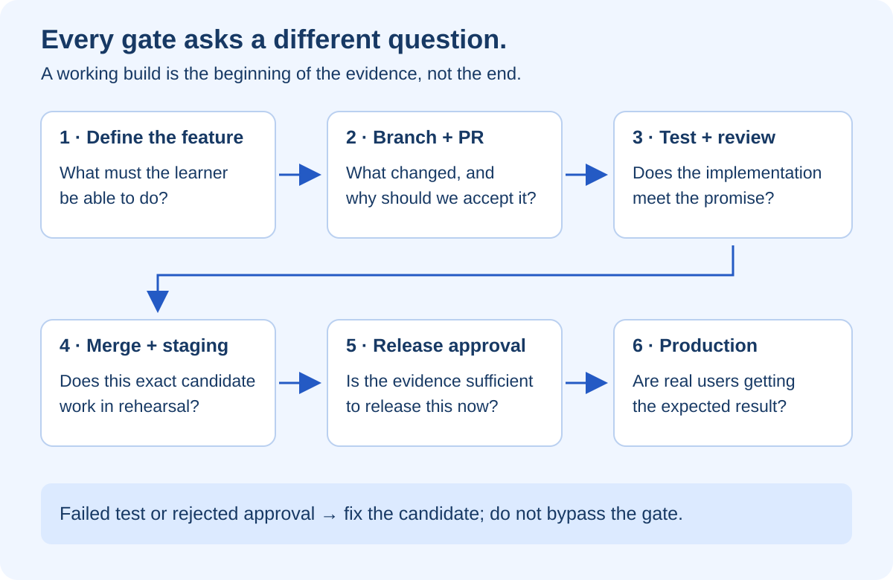
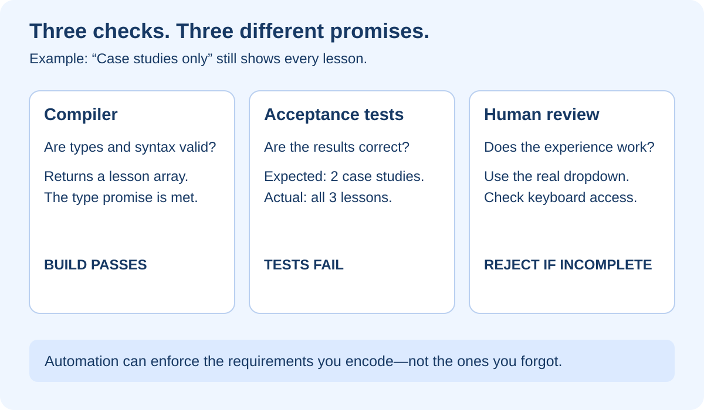
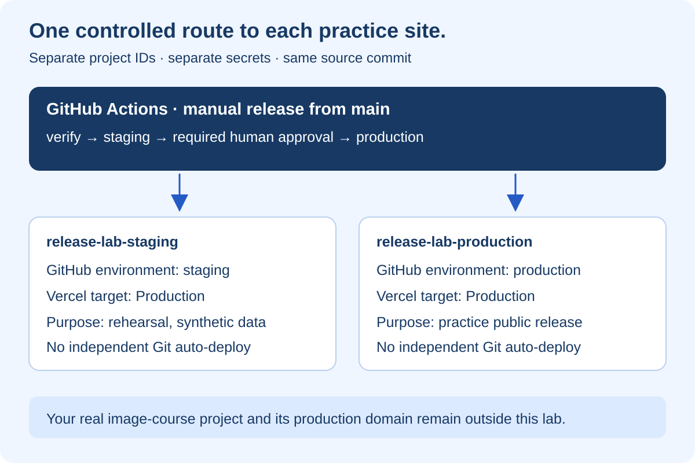

# From Solo Pushes to Confident Team Releases

## At a glance

This is a hands-on CI/CD course for someone who can build a project but has not recently worked with a team's release process. You will practice with a tiny Learning Library website, deliberately break a feature without breaking compilation, watch a test reject it, introduce pull-request protection, and release through staging and an approval gate. The destination is not a complicated pipeline. It is understanding exactly who checks what before a change reaches users.

The course has ten lessons. Take one or two per session. Each lesson ends with something you can demonstrate, not just something to remember. You need Git, Node.js 22 or newer, a GitHub account, and—only for the deployment lessons—a Vercel account. A second person is needed to practice genuinely independent review. The local exercises work without either cloud account.

> **The answer to your main question:** A compiler checks whether the program can be built. It does not check whether you finished the feature. You teach your pipeline what “finished” means through acceptance tests, and you ask a reviewer to check the things those tests do not cover. GitHub can then block merging or deployment when those checks fail.

This course includes a working exercise folder and two workflow examples. They are intentionally outside this repository's active GitHub Actions folder. Nothing in this course has changed your live website's deployment rules or deployed a practice project.

## Lesson 1 — Understand the journey before the commands



### What the diagram teaches

Imagine you add a “Case studies only” filter to your learning website. The dropdown appears. The page loads. The build is green. But selecting the option still shows everything. Technically valid code has produced an unfinished experience.

In your old workflow, you might push this to the main branch and Vercel would publish it. In the practice workflow, there are several doors between your laptop and your visitors. Each door asks a different question.

Your **feature branch** is a separate line of work. It lets you make changes without immediately changing the shared main branch. A **pull request**, usually shortened to PR, is a request to bring that work into main. It is also a discussion space containing the change, test results, comments, and review decisions.

**Continuous integration**, or CI, means frequently combining work and checking that it still works together. In this course, GitHub Actions runs the build and tests whenever you update a PR. **Continuous delivery** means preparing a releasable change while retaining a deliberate release decision. **Continuous deployment** takes that further: qualifying changes go live automatically. Neither is inherently more professional. The right choice depends on risk and the quality of your checks.

Our course uses continuous delivery. After merging, you deliberately start a release. It goes to a rehearsal website called **staging**, someone tests the actual experience, and an authorized reviewer approves or rejects production deployment. Only then does it reach **production**, the website your real visitors use.

### Two different meanings of staging

| Term | Plain-English meaning | Example |
|---|---|---|
| Git staging area | The changes selected for your next commit | `git add src/filter.ts` |
| Staging environment | A running rehearsal copy of the application | A separate Vercel practice project |
| PR preview | A temporary deployment for one proposed change | A preview of a feature branch |
| Production | The real service users rely on | Your public course website |

Putting a file in Git's staging area does not deploy it to a staging website. They are unrelated uses of the same word.

### Your team, even if you are practicing alone

The developer implements the change. The reviewer checks the implementation and tests. The product owner or tester checks whether it solves the original problem. The release approver decides whether this particular candidate should go live now. An operations owner watches for problems afterward. Small teams combine roles, but separating the responsibilities makes missing checks visible.

**Checkpoint:** Explain why “the build is green” answers only one of several release questions.

## Lesson 2 — Write down what finished means

The practice feature is deliberately small: filter three lessons by category. This lets you concentrate on the release process instead of learning a large application at the same time. The app is TypeScript compiled to browser JavaScript, not Next.js. In Lesson 10 you will map the same process onto your real Next.js website and agent projects.

### The feature ticket

**Title:** As a learner, show only the category I selected.

**Why:** Someone looking for a practical project should not have to search through all the theory lessons.

**Acceptance criteria:**

1. “All lessons” shows MCP foundations, FilePilot, and HarborCare.
2. “Case studies only” shows FilePilot and HarborCare, but not MCP foundations.
3. “Courses only” shows MCP foundations, but neither case study.
4. An empty collection returns an empty list without an error.
5. Filtering does not change the original collection.
6. The dropdown can be operated with a keyboard, its label is understandable, and the visible list updates when the choice changes.

The first five criteria can be tested directly against the filtering function. The sixth concerns the browser experience. Our supplied unit tests do not prove it. You will test it manually in staging; later you can add a browser test with Playwright. This distinction matters: testing the function does not prove that the dropdown actually calls that function.



### The definition of done

Acceptance criteria describe this feature. A **definition of done** is your recurring team agreement: tests pass, a reviewer has approved, accessibility has been checked, documentation is updated where necessary, staging evidence is recorded, and rollback has been considered.

A checked box is a claim, not an automatic guarantee. A percentage coverage number is also not proof of completeness. You can execute every line while asserting the wrong thing. Useful tests describe visible outcomes: “the result contains only these two case studies,” not merely “the function returned an array.”

**Checkpoint:** Write one acceptance criterion for a feature you recently shipped. Ask yourself what test would turn red if that feature were missing.

## Lesson 3 — Build the deliberately incomplete app

### Keep this away from your live repository

Use a new local folder and a new GitHub repository called `release-lab`. Do not create a nested Git repository inside `image-course`. Do not connect the practice app to your real production domain or databases. The app contains synthetic lesson titles only.

The supplied starter lives at `docs/training/ci-cd/exercises/release-lab` inside this learning repository. The workflow examples live next to it under `docs/training/ci-cd/examples`. Copying them is a convenience; you can also create each file yourself and type its contents while following the explanations below.

PowerShell example, using a destination that must not already exist:

```powershell
if (Test-Path -LiteralPath E:\release-lab) {
    throw 'Choose a new empty practice location first.'
}
Copy-Item -LiteralPath E:\image-course\docs\training\ci-cd\exercises\release-lab -Destination E:\release-lab -Recurse
Set-Location E:\release-lab
npm install
npm run build
npm test
```

The initial `npm install` creates a lockfile if needed. Commit that lockfile. Later, `npm ci` installs exactly the dependency versions it records and fails if the package manifest and lockfile disagree. This is one way your laptop and the CI runner agree on the tools they are using. [npm's clean-install reference](https://docs.npmjs.com/cli/v11/commands/npm-ci)

### Understand every file

```text
release-lab/
├── src/
│   ├── filter.ts           The behavior we are learning to test
│   └── app.ts              Connects the dropdown to the list
├── tests/
│   └── filter.test.mjs     Five acceptance checks using Node's test runner
├── scripts/
│   ├── copy-page.mjs       Adds the HTML page to the compiled output
│   └── serve.mjs           Serves only the three allowed local page files
├── index.html             The visible page, label, dropdown, and blue styling
├── package.json           Named commands and the TypeScript dependency
├── package-lock.json      Exact dependency installation record
├── tsconfig.json          How TypeScript builds the app
├── vercel.json            Static deployment settings; Git auto-deploy disabled
├── .gitignore             Keeps dependencies, secrets, and output out of Git
├── dist/                  Generated by the build; never hand-edit this
└── .github/workflows/     You add the two workflow examples later
```

`filter.ts` contains a type called `Category`. Its allowed choices are `all`, `course`, and `case-study`. `Lesson` describes the two pieces of information each lesson carries: a title and its category. The function promises to return a list of lessons.

Its implementation is intentionally unfinished:

```typescript
export function filterLessons(lessons: Lesson[], category: Category): Lesson[] {
  return lessons;
}
```

That return value satisfies the type promise. It does not satisfy the user's request. TypeScript therefore compiles it successfully. This is the exact situation you asked about.

`app.ts` holds three sample lessons. Its `render()` function reads the dropdown, calls `filterLessons`, creates list items, and replaces the displayed results. The change listener runs `render()` whenever you choose another category. It also runs once when the page opens.

`tsconfig.json` turns on strict type checking, writes compiled files into `dist`, and refuses to emit output when there are type errors. Those protections still cannot infer our missing category behavior. `copy-page.mjs` copies the HTML into that same output folder. `serve.mjs` is a small local-only web server, not a general production server.

### Observe the red test

The expected starting result is:

```text
npm run build     PASS — valid TypeScript
npm test          FAIL — 3 passing tests, 2 failing tests
```

The case-study test expects two names. It receives three because the function returns the whole list. The course test fails for the same reason. These failures are deliberate, not a broken installation.

Run `npm start`, open `http://127.0.0.1:4173`, and select “Case studies only.” You can now see the bug yourself. Stop the local server with Ctrl+C when finished.

### Read one test carefully

```javascript
test('case-study excludes courses', () => {
  assert.deepEqual(
    filterLessons(lessons, 'case-study').map(x => x.title),
    ['FilePilot', 'HarborCare']
  );
});
```

`test` names a check. The fixture called `lessons` is predictable sample input. The function call performs the behavior. `map` extracts the titles. `assert.deepEqual` compares the resulting list with the exact list we promised the learner. A mismatch produces a failing process exit code. CI understands that exit code as failure.

The tests import compiled JavaScript from `dist`, so always rebuild after editing TypeScript. `npm run check` runs both commands in the correct order.

**Checkpoint:** Make the build succeed and the tests fail. Describe which missing requirement each failure represents. Do not fix it yet—we want to see GitHub reject it first.

## Lesson 4 — Create the repository and your first real PR

### Bootstrap once, then protect main

In GitHub, create an empty repository named `release-lab`. A public repository containing only this synthetic demo is the simplest way to practice the approval features described later. Never make a real private project public just to unlock training features.

In the practice folder:

```powershell
git init -b main
git add .gitignore package.json package-lock.json tsconfig.json vercel.json index.html src scripts tests
git commit -m "chore: create deliberately incomplete release training app"
git remote add origin https://github.com/YOUR-USERNAME/release-lab.git
git push -u origin main
```

Replace `YOUR-USERNAME` first. This is the one-time bootstrap of a disposable repository, not permission to push an unfinished feature to your real website. Do not deploy this baseline. There is no active deployment workflow yet.

Create `.github/workflows` in the practice repository. Copy the supplied `examples/ci.yml` there as `ci.yml`. Commit and push this bootstrap workflow to main so GitHub can run it and discover its check name. This initial run will fail because the deliberately incomplete app fails two tests. That is expected.

Now configure protection as explained in Lesson 6, and create your feature branch:

```powershell
git switch -c feature/category-filter
```

Make a small honest improvement to the dropdown's help text in `index.html` but leave the broken filter unchanged. Commit and push:

```powershell
git add index.html
git commit -m "feat: introduce category filter experience"
git push -u origin feature/category-filter
```

On GitHub choose **Compare & pull request**, with `main` as the base. Explain that this is the intentionally failing training PR. Include the acceptance criteria, what you changed, how you tested it, and the known incomplete behavior. A draft PR is useful communication while working; it is not a replacement for required checks.

### What your reviewer should read

Use this PR description:

```text
Purpose: Help learners find practical projects by category.
Acceptance criteria: all / courses / case studies / empty input / no mutation.
Evidence: build result, test result, and later the staging candidate URL.
Manual check: keyboard selection changes the visible list.
Known gap: category filtering is not implemented yet.
Risk: the wrong list may appear; no data is written.
Rollback: restore the previous practice deployment.
```

**Checkpoint:** You have a PR with a passing compilation step and a failing test step. The failure is visible to another person, not just in your terminal.

## Lesson 5 — Understand GitHub Actions line by line

GitHub Actions is the service that executes your instructions. A **workflow** is the whole recipe; a **job** runs on a machine called a **runner**; a **step** is one action or shell command within that job. YAML is the indentation-sensitive file format used to write the recipe. [GitHub's workflow syntax reference](https://docs.github.com/en/actions/reference/workflows-and-actions/workflow-syntax)

Here is the complete CI workflow supplied with the course:

```yaml
name: Pull request quality
on:
  pull_request:
    branches: [main]
  push:
    branches: [main]
permissions:
  contents: read
concurrency:
  group: ci-${{ github.workflow }}-${{ github.ref }}
  cancel-in-progress: true
jobs:
  quality:
    name: quality
    runs-on: ubuntu-latest
    timeout-minutes: 10
    steps:
      - uses: actions/checkout@11d5960a326750d5838078e36cf38b85af677262 # v4
        with:
          persist-credentials: false
      - uses: actions/setup-node@49933ea5288caeca8642d1e84afbd3f7d6820020 # v4
        with:
          node-version: '22'
          cache: npm
      - run: npm ci
      - name: Compile TypeScript and package the page
        run: npm run build
      - name: Test acceptance criteria
        run: npm test
```

The two triggers run the recipe for PRs targeting main and for commits pushed to main. `contents: read` avoids asking for write access. Concurrency cancels an obsolete CI run when newer work on the same ref arrives. That is useful for tests; it is not a policy we blindly reuse for a production deployment.

The job is named `quality`. Remember that name when configuring required checks. Checkout downloads the code; setup-node supplies Node. The long values after `@` pin the actions to specific commits, instead of allowing an action tag to change underneath you. These pins were resolved from the official v4 tags while authoring the course; review and update them as part of maintenance.

`npm ci` installs dependencies, the build produces the app, and the tests check behavior. A failed test stops this job from succeeding. There is deliberately no `continue-on-error`, no condition that skips the tests, and no path filter that accidentally prevents the required workflow from running.

### Read the failure instead of rerunning blindly

Open the PR's **Checks** view or the repository's **Actions** tab. Open the `quality` job. Expand “Test acceptance criteria.” Find the test name and the expected-versus-actual list. This is your diagnostic trail: ticket → expectation → assertion → failure.

Do not delete the test to obtain a green badge. Fix the behavior:

```typescript
export function filterLessons(lessons: Lesson[], category: Category): Lesson[] {
  if (category === 'all') return lessons;
  return lessons.filter(lesson => lesson.category === category);
}
```

The early return handles “all.” Otherwise `filter` keeps only matching lessons without changing the original array. Replace only the function in `src/filter.ts`; keep its type declarations.

```powershell
npm run check
git add src/filter.ts
git commit -m "fix: honor the selected lesson category"
git push
```

The same PR updates automatically. All five tests should now pass. You do not need another PR for each correction to the same feature.

**Checkpoint:** Explain every top-level workflow field to someone else, and show the red run followed by the green run.

## Lesson 6 — Make a failed check actually block merging

> A test reporting failure and a rule preventing release are different things. A red check is evidence. A required-check rule turns that evidence into a gate.

In the practice repository, open **Settings → Rules → Rulesets** and create an active branch ruleset targeting `main`. Where your account exposes classic branch protection instead, use **Settings → Branches** and configure the equivalent protection. Account and repository visibility affect which controls are available.

Require a pull request before merging. Require the `quality` status check, selecting the check GitHub observed from your initial CI run. Require the branch to be up to date before merging for this simple training setup. Block force pushes and branch deletion. Leave no routine bypass actor. Require one approval when you have a real second reviewer, and dismiss stale approvals when new changes are pushed. [GitHub's protected-branch guide](https://docs.github.com/en/repositories/configuring-branches-and-merges-in-your-repository/managing-protected-branches/about-protected-branches)

Do this before fixing the PR if you want to witness the original failure blocking merge. If you already fixed it, introduce the original broken function again on a new practice branch and repeat the experiment.

With the failing PR open, verify that GitHub says a required check failed and does not offer an ordinary successful merge. After the fix passes, have your reviewer inspect the code and actual behavior. Resolve their comments. Merge only when the protected conditions are satisfied.

### Solo practice is not independent review

You can practice test enforcement alone. You cannot honestly demonstrate independent PR approval by approving your own work. Invite a trusted collaborator to the synthetic training repository. If you practice without a required reviewer, label it a solo exercise—not a complete team approval system.

### A subtle trap: skipped does not always mean blocked

GitHub can treat skipped or neutral check conclusions as acceptable for required status checks. Conversely, a required workflow skipped by a path or branch filter can remain pending. Keep this course's `quality` job unconditional. If you later split jobs, add an explicit final gate that fails unless every required upstream result is `success`. If you enable a merge queue later, add its `merge_group` trigger too. [GitHub's required-check troubleshooting guide](https://docs.github.com/en/pull-requests/how-tos/merge-and-close-pull-requests/troubleshooting-required-status-checks)

### The reviewer checks the tests too

A developer could weaken an assertion, remove a test, or edit the workflow. Branch rules do not understand whether a replacement test is meaningful. Review changes to tests and workflow files especially carefully. A team can use CODEOWNERS and required code-owner review for sensitive files, but the owners must be real authorized people and the rule must be enabled; a CODEOWNERS file alone is not enforcement.

**Checkpoint:** Capture one blocked merge and one approved merge. State which rule changed the outcome.

## Lesson 7 — Set up staging without a hidden bypass



### Two practice projects, one source repository

Create two separate Vercel projects: `release-lab-staging` and `release-lab-production`. Both use the same small app, but neither is your real course website. This course avoids depending on a paid custom staging-environment feature. Each project has its own deployment address and settings.

In this design, Vercel's **Production** target inside the staging project is still only our rehearsal website. The word describes the target within that project, not the importance of the whole system. That is why the staging job below uses `--prod`. Project identity is the safety boundary.

Use separate sample data and credentials. The demo requires no database. When you later adapt it to a real app, staging must not be able to send real patient records, charge a real card, or modify your real filesystem. A separate URL is not data isolation.

### Stop automatic deployments in the practice setup

Do not import the practice repository and assume GitHub approval will automatically govern Vercel's own Git deployments. Vercel's Git integration is a separate trigger path. It normally deploys changes from Git independently of our release job. [Vercel's Git deployment overview](https://vercel.com/docs/git)

The starter's `vercel.json` includes:

```json
"git": { "deploymentEnabled": false }
```

This disables Git-triggered deployments for the configured project. For the clearest training boundary, leave both practice projects disconnected from Git and deploy them through the CLI. Verify their Git settings and confirm a push does not create an independent production deployment. Configuration files are editable; do not treat an editable flag as your only organizational control. [Vercel's Git configuration reference](https://vercel.com/docs/project-configuration/git-configuration)

### Link deliberately and collect the project IDs

Install the pinned CLI version used in the examples, authenticate, and link the practice folder to the staging project:

```powershell
npm install --global vercel@58.4.0
vercel login
vercel whoami
vercel link
```

Choose the intended team and staging project in the prompts. Read the generated `.vercel/project.json` to identify its `orgId` and `projectId`. Repeat `vercel link` and choose the production practice project to record that separate ID. Verify the link each time. Do not use the IDs from `image-course`, and do not commit `.vercel` or tokens.

In each Vercel practice project, set the framework preset to **Other**, output directory to `dist`, install command to `npm ci`, build command to `npm run build`, and Node version to 22.x. The starter configuration carries the build/output settings. Check them in the dashboard too.

### Create the GitHub environments before running the workflow

In the practice GitHub repository, open **Settings → Environments**. Create exactly `staging` and `production`. Restrict deployment branches to `main`. For production, configure a required reviewer, prevent self-review for genuine team practice, and disallow administrator bypass where available. Merely writing `environment: production` in YAML does not create those protections for you.

Inside **each environment**, add secrets named `VERCEL_TOKEN`, `VERCEL_ORG_ID`, and `VERCEL_PROJECT_ID`. Use the matching project's ID. Prefer separately scoped credentials where supported; a project ID selects a destination but does not itself restrict a broadly authorized token. Keep production credentials out of repository-wide secrets and out of PR jobs.

GitHub's current documentation says public repositories on current plans support environments and protection rules. Private/internal environments require an appropriate paid plan, and required reviewers on Free, Pro, and Team are limited to public repositories. Check your account's actual controls before assuming the gate exists. Do not publish private data to work around plan restrictions. [GitHub's environment configuration and availability](https://docs.github.com/en/actions/how-tos/deploy/configure-and-manage-deployments/manage-environments)

**Checkpoint:** Show two distinct Vercel project IDs, a protected GitHub production environment, and no independent Git auto-deploy path in either practice project.

## Lesson 8 — Release through staging, then approve production

Copy the supplied `examples/release.yml` into `.github/workflows/release.yml` in the practice repository. Introduce it through a PR, review it, and merge it. The file must exist on the default branch before the manual workflow trigger is available.

### The release recipe

```text
Run workflow on main
        │
        ▼
verify: install → compile → acceptance tests
        │ success only
        ▼
staging: build → test → deploy to STAGING PROJECT → smoke check
        │ success only
        ▼
production environment waits for a human decision
        ├── reject → production job does not run
        └── approve → build → test → deploy to PRODUCTION PROJECT → smoke check
```

The supplied file is complete, not just this diagram. Open it alongside this section and read the three jobs: `verify`, `staging`, and `production`.

`workflow_dispatch` gives you the **Run workflow** button. The `verify` job accepts only a run from `main`; choosing a feature branch skips the release path. Every checkout uses the same `github.sha`, the commit captured when you started that run. A moving main branch does not silently change which source code the later job checks out.

`needs: verify` makes staging depend on successful verification. `needs: staging` makes production depend on staging. The production job references the protected GitHub environment, so its configured approval rules apply before the job starts and obtains that environment's secrets. [GitHub's deployment-control guide](https://docs.github.com/en/actions/how-tos/deploy/configure-and-manage-deployments/control-deployments)

### What the deployment commands do

The two deployment jobs use the same sequence, but different environment-scoped project IDs:

```bash
vercel pull --yes --environment=production --token "$VERCEL_TOKEN"
vercel build --prod --token "$VERCEL_TOKEN"
npm test
vercel deploy --prebuilt --prod --yes --token "$VERCEL_TOKEN"
```

These commands run in Bash on GitHub's Ubuntu runner, not in your local PowerShell session. `pull` downloads the chosen project's settings. `build` creates deployable output. The tests run again against that build. `deploy --prebuilt` uploads the output rather than asking Vercel to rebuild it remotely. The token comes from a secret-backed environment variable, never a literal value in your file. Do not echo it or enable shell tracing. [Vercel's GitHub Actions deployment guide](https://vercel.com/docs/git/vercel-for-github)

The workflow records the immutable candidate URL and source commit in its run summary. Its smoke command uses `vercel curl` so you do not have to disable deployment protection. It requests `/filter.js` with curl's failure flag. That proves the module is reachable; it does **not** prove that the browser interaction works. [Vercel curl reference](https://vercel.com/docs/cli/curl)

### Actually perform the human staging check

Open **Actions → Practice release → Run workflow**, choosing `main`. Wait for staging to finish. Use the candidate URL from that run, not a bookmarked staging alias that another run could have changed.

Check all three dropdown choices. Confirm the exact names in each result. Navigate with Tab and the keyboard. Reload the page. Confirm there is no unexpected browser error. Record the candidate URL, full commit SHA, your name, the checks performed, and the result in the PR or release record.

When GitHub shows the waiting production job, choose **Review deployments**. In your first practice run, deliberately **reject** it with a reason such as “Training exercise: acceptance evidence missing.” Confirm that no production deployment was created. Then start a new release run, redo the staging checks for that run, and have the authorized reviewer approve it.

This is the second answer to your original question: an incomplete feature can be rejected **even when automated tests pass**, because the staging reviewer sees the missing experience and declines production approval.

### Same source is not always the same artifact

Both projects build the same commit, but they build separately. Environment variables and build-time settings may differ. This course therefore makes a **same-source** guarantee, not a byte-identical artifact-promotion guarantee. Tests run in both jobs, and you must verify production afterward too.

An advanced pipeline can create a production-configured candidate without assigning its public domain, test it, and promote that exact deployment. Do not casually promote a staging-configured build: public environment variables can be embedded during compilation. Learn the simple isolated-project workflow first.

### Concurrency is not a complete release-order policy

`cancel-in-progress: false` avoids aborting an active release just because another is requested. It does not give you an unlimited first-in-first-out release queue or prevent every stale-release scenario. During practice, allow only one release run at a time. Before approval, check that its commit is still the intended candidate. Cancel obsolete waiting runs rather than approving them after a newer release.

**Checkpoint:** Demonstrate one rejected release and one approved release. Explain exactly why the production job did not start in the rejected run.

## Lesson 9 — Recover, investigate, and keep credentials safe

### A green deployment can still be a bad release

After production deployment, open the practice production website and repeat the critical interaction. Check the release record against the expected commit and candidate URL. If a smoke test fails after deployment, the workflow reports a failure, but the deployment may already be live. A red badge does not automatically undo it.

In the Vercel practice production project, identify a previously verified deployment before you need it. To rehearse recovery, use the dashboard's rollback action where available, or the CLI's `vercel rollback <previous-deployment-url>` after confirming the correct project link and account. Verify the restored site. Record the incident and create a corrective PR. Rollback availability and behavior depend on your project/plan; inspect the available control before your rehearsal. [Vercel's rollback reference](https://vercel.com/docs/cli/rollback)

An application rollback does not undo database writes, sent emails, external agent actions, or filesystem moves. Those need separate recovery designs. Our tiny demo deliberately has none of those side effects.

### Troubleshooting by symptom

| What you see | Likely explanation | What to inspect |
|---|---|---|
| Build passes, tests fail | Valid code does the wrong thing | Named assertion and acceptance criterion |
| Red tests but merge still allowed | Check is not required, or a bypass exists | Active ruleset and selected check name |
| Checks never appear | Workflow absent, disabled, filtered, or awaiting fork approval | Actions settings and trigger |
| Merge blocked after a new push | New commit needs fresh checks or approval | Latest PR commit and review status |
| Production starts without waiting | Environment lacks reviewer protection, or a different deploy path ran | Exact environment name and Vercel Git settings |
| Vercel authentication fails | Missing, expired, or incorrectly scoped token | Environment secret names and team access; never print token |
| Deployment goes to wrong site | Wrong project ID or local link | Environment-scoped IDs and `.vercel/project.json` |
| Smoke test fails after deployment | App is already deployed but its check failed | Candidate URL, response, logs, and rollback decision |
| Tests pass but dropdown does nothing | Function test misses the browser wiring | Staging manual check; add a browser regression test |

### Security habits to learn now

Run PR checks without production secrets. Use `pull_request`, not a privileged `pull_request_target` workflow that checks out and executes untrusted PR code. Review workflow changes as code. Pin actions to reviewed commit SHAs, keep dependencies maintained, and avoid passing user-written PR text directly into shell commands. Never upload environment files as build artifacts. GitHub's log masking is not permission to print secrets. [GitHub's Actions security guidance](https://docs.github.com/en/actions/reference/security/secure-use)

A GitHub environment protects access through jobs that reference it; it cannot stop someone with independent Vercel credentials from deploying manually. A real team also controls Vercel roles, deploy tokens, administrator bypass, and emergency-release procedures. Policies require both technical gates and account governance.

**Checkpoint:** Write a five-line rollback plan containing the project, previous known-good deployment, authorized operator, verification step, and side effects that rollback would not reverse.

## Lesson 10 — Apply this to your website and agent projects

### Your current Next.js learning library

Do not copy the lab's static `vercel.json` over the real website configuration. Keep the real Next.js build and content pipeline. A sensible starting CI job for this repository would run these commands, plus meaningful tests you add for real user behavior:

```bash
npm ci
npm run lint
npm run build
npm run verify:content
```

Here `npm run build` already regenerates content and builds Next.js. `verify:content` checks the generated library contract. Neither proves that a reader can navigate, filter, bookmark, or search successfully. Add browser acceptance tests for those experiences. Before making a check required, establish its actual baseline and fix existing failures; do not label a command as passing because it appears in a document.

For example, “search FilePilot and open its start-here article” is a useful acceptance journey. “The search component renders” is much weaker. Likewise, a link checker can prove an image URL exists while missing that the wrong diagram was attached to the lesson.

### The same gates apply beyond a website

| Project | Example acceptance gate | Staging boundary |
|---|---|---|
| MCP tool server | Unauthorized caller cannot invoke a restricted tool | Synthetic tools and restricted test credentials |
| RAG assistant | A user cannot retrieve another user's restricted documents | Separate test index with known allowed/denied documents |
| A2A agent system | Repeated task delivery does not execute an action twice | Test agents, sandbox endpoints, recorded task IDs |
| HarborCare | A recipient receives only its permitted fields | Synthetic patients only; never real patient data |
| FilePilot | An unapproved move is rejected and approved moves remain within the allowed root | Disposable sandbox folder, never a home directory |

For Python services, replace the TypeScript build/test commands with your project's pinned dependency installation and `pytest` suite. Keep the same branch, review, approval, and evidence concepts. A passing model-quality evaluation should not substitute for deterministic permission and privacy tests. Model answers may vary; authorization rules must not depend on the model being agreeable.

### Feature flags are a separate tool

A feature flag can keep finished-but-not-yet-released behavior hidden from users while code is merged. It is not a waiver for unsafe code. Test both states. A hidden UI button does not protect a backend endpoint. Record who owns the flag and when it should be removed.

### Your graduation exercise

Repeat the workflow with a second feature: search lesson titles without regard to letter case.

1. Write examples before coding: `filepilot`, `FILEPILOT`, an empty query, and a query with no results.
2. Add a deliberately incomplete implementation that compiles.
3. Write tests that expose its missing behavior.
4. Open a PR and observe the required-check rejection.
5. Fix the code, obtain review, and merge.
6. Start a release; check the exact staging candidate.
7. Reject one release on purpose and explain why.
8. Approve a fresh verified run and test practice production.
9. Rehearse rollback to the previous verified practice release.
10. Explain which parts of this process a malicious or overprivileged operator could still bypass.

You have learned the workflow when you can demonstrate those steps without asking an AI to hide the mechanics from you. An AI can help write a test, but you should be able to explain the requirement that test represents and why its failure should stop a release.

## Quick-reference legend

| Term | What it means here |
|---|---|
| Commit / SHA | A recorded source snapshot and its identifier |
| Branch | A named line of development |
| Pull request | Proposed changes, discussion, checks, and review before merging |
| Merge | Bring the accepted change into another branch |
| Workflow / job / step | Whole automation recipe / runner task / individual instruction |
| Runner | The machine executing a job |
| Artifact | Output of a build, such as deployable JavaScript and HTML |
| Unit test | Checks a small piece of behavior in isolation |
| Acceptance test | Checks a promised outcome; can be automated or manual |
| E2E test | Exercises a user journey across the running system |
| Smoke test | A quick basic health check, not exhaustive validation |
| Ruleset | Repository rules that enforce conditions such as required PR checks |
| Environment gate | Conditions before a deployment job may begin |
| Secret | A protected credential, not a value to commit or display |
| Rollback | Restore a previous deployment; not necessarily previous data |
| Feature flag | A controlled switch for exposing behavior |
| CI / delivery / deployment | Check integrated work / prepare a releasable change / publish it |

## What has—and has not—been done for you

The local exercise demonstrates real TypeScript compilation and real failing/passing tests. The workflow examples describe the cloud steps you will activate in your own practice repository. They do not configure branch protection or environment approvals by themselves.

No GitHub repository, cloud environment, collaborator, secret, or Vercel practice deployment has been created by writing this course. Your live website's release behavior remains unchanged. Complete the cloud checkpoints yourself before claiming that the full release chain is enforced.

Platform references were checked on 27 August 2026. Interface labels, plan availability, and tool versions can change. The enduring lesson is the separation of requirements, evidence, enforcement, and authorization.

## Appendix — Complete staging and production workflow

Save this as `.github/workflows/release.yml` in the separate practice repository after completing Lesson 7. This is the same content as the supplied example. The names `staging` and `production` must match your preconfigured GitHub environments. Without the production review rule, this file will not wait for a human.

```yaml
name: Practice release
on:
  workflow_dispatch:
permissions:
  contents: read
concurrency:
  group: release-lab
  cancel-in-progress: false
jobs:
  verify:
    if: github.ref == 'refs/heads/main'
    runs-on: ubuntu-latest
    timeout-minutes: 10
    steps:
      - uses: actions/checkout@11d5960a326750d5838078e36cf38b85af677262 # v4
        with:
          ref: ${{ github.sha }}
          persist-credentials: false
      - uses: actions/setup-node@49933ea5288caeca8642d1e84afbd3f7d6820020 # v4
        with:
          node-version: '22'
          cache: npm
      - run: npm ci
      - run: npm run check
  staging:
    needs: verify
    runs-on: ubuntu-latest
    timeout-minutes: 15
    environment:
      name: staging
      url: ${{ steps.deploy.outputs.url }}
    env:
      VERCEL_ORG_ID: ${{ secrets.VERCEL_ORG_ID }}
      VERCEL_PROJECT_ID: ${{ secrets.VERCEL_PROJECT_ID }}
      VERCEL_TOKEN: ${{ secrets.VERCEL_TOKEN }}
    outputs:
      url: ${{ steps.deploy.outputs.url }}
    steps:
      - uses: actions/checkout@11d5960a326750d5838078e36cf38b85af677262 # v4
        with:
          ref: ${{ github.sha }}
          persist-credentials: false
      - uses: actions/setup-node@49933ea5288caeca8642d1e84afbd3f7d6820020 # v4
        with:
          node-version: '22'
      - run: npm install --global vercel@58.4.0
      - run: vercel pull --yes --environment=production --token "$VERCEL_TOKEN"
      - run: vercel build --prod --token "$VERCEL_TOKEN"
      - run: npm test
      - id: deploy
        shell: bash
        run: |
          url=$(vercel deploy --prebuilt --prod --yes --token "$VERCEL_TOKEN")
          echo "url=$url" >> "$GITHUB_OUTPUT"
          echo "Staging candidate: $url | Commit: $GITHUB_SHA" >> "$GITHUB_STEP_SUMMARY"
      - name: Smoke test the deployed module (supports deployment protection)
        env:
          CANDIDATE_URL: ${{ steps.deploy.outputs.url }}
        run: vercel curl /filter.js --deployment "$CANDIDATE_URL" --token "$VERCEL_TOKEN" -- --fail --silent --show-error
  production:
    needs: staging
    runs-on: ubuntu-latest
    timeout-minutes: 15
    environment:
      name: production
      url: ${{ steps.deploy.outputs.url }}
    env:
      VERCEL_ORG_ID: ${{ secrets.VERCEL_ORG_ID }}
      VERCEL_PROJECT_ID: ${{ secrets.VERCEL_PROJECT_ID }}
      VERCEL_TOKEN: ${{ secrets.VERCEL_TOKEN }}
    steps:
      - uses: actions/checkout@11d5960a326750d5838078e36cf38b85af677262 # v4
        with:
          ref: ${{ github.sha }}
          persist-credentials: false
      - uses: actions/setup-node@49933ea5288caeca8642d1e84afbd3f7d6820020 # v4
        with:
          node-version: '22'
      - run: npm install --global vercel@58.4.0
      - run: vercel pull --yes --environment=production --token "$VERCEL_TOKEN"
      - run: vercel build --prod --token "$VERCEL_TOKEN"
      - run: npm test
      - id: deploy
        shell: bash
        run: |
          url=$(vercel deploy --prebuilt --prod --yes --token "$VERCEL_TOKEN")
          echo "url=$url" >> "$GITHUB_OUTPUT"
          echo "Production candidate: $url | Commit: $GITHUB_SHA" >> "$GITHUB_STEP_SUMMARY"
      - name: Smoke test production
        env:
          CANDIDATE_URL: ${{ steps.deploy.outputs.url }}
        run: vercel curl /filter.js --deployment "$CANDIDATE_URL" --token "$VERCEL_TOKEN" -- --fail --silent --show-error
```

The external example files are conveniences for copying. This embedded listing lets you trace the whole release without leaving the reading document.
