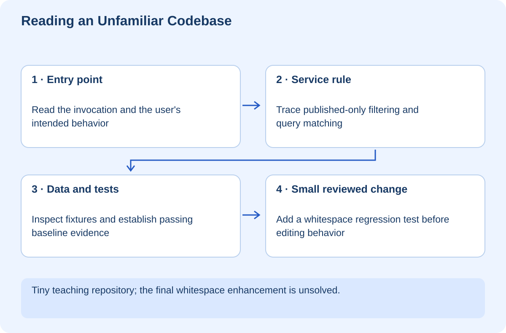

# Reading and Taking Over an Unfamiliar Codebase

## At a glance

This workshop teaches you to enter a project without trying to understand every file before making a useful contribution. You will identify an entry point, trace one feature through a service to its data, establish a passing baseline, and plan a small change with a clear regression test. A tiny Python repository provides a safe first rehearsal.

Use Python 3.10 or newer. The lab is `exercises/reader-lab`. It has no dependencies, network access, or real data. It deliberately leaves whitespace handling as your independent change rather than silently completing the exercise for you.



## Lesson 1 — Start with the purpose and operating instructions

When you join a project, first learn what it is for, how it runs, and what must not be broken. Read the README and repository-specific instructions, inspect the package or build configuration, and check the current branch and working-tree state.

Do not begin by reformatting files or upgrading dependencies. Those changes create noise before you know the baseline. Existing uncommitted changes may belong to someone else. Preserve them and clarify overlap before editing.

Ask which behavior you are trying to understand. In the lab, that behavior is “show published lesson titles matching a query.” This gives you a route through the code rather than an obligation to read everything in alphabetical order.

**Checkpoint:** Write a two-sentence project description and name one invariant it must preserve.

## Lesson 2 — Find the entry point

Run these commands from the lab directory:

```powershell
python app.py MCP
python test.py
```

The application should print the published MCP title. The tests verify empty-query behavior, mixed-case matching, and exclusion of the unpublished record.

The file map is small:

```text
reader-lab/
├── app.py       Reads a command-line query and displays the result
├── service.py   Applies visibility and matching rules
├── catalog.py   Holds synthetic records
└── test.py      Documents three baseline behaviors
```

The entry point handles how the program is invoked. The service owns the query behavior. The catalogue holds data. The tests describe parts of the contract. This division is simple enough to trace by hand.

## Lesson 3 — Follow data, not just names

Read `app.py`: the argument becomes a query passed to `visible_titles`. Read the service: it selects published items and performs a case-insensitive substring check. Read the catalogue: one record is deliberately unpublished.

Now follow the result back to the caller. The service returns titles, not full records; the entry point prints that list. There is no database, HTTP server, or browser layer to invent while explaining the code.

In a larger project, use text search for the function or route name and inspect its callers. A diagram should represent calls you have actually traced, not guesses based on filenames. Generated files and compiled bundles are usually not the best starting point for understanding source behavior.

**Checkpoint:** Explain where you would change matching rules without accidentally changing which records are published.

## Lesson 4 — Establish evidence before editing

Run the documented baseline tests and record the result. If they fail before your change, distinguish existing failures from new ones. A statement such as “tests fail” is incomplete without naming the check and when it first failed.

Inspect the expected outputs. Tests may be incomplete or outdated, but they still reveal assumptions. Do not treat implementation comments, documentation, and tests as equally current without comparing them to actual behavior.

For your real learning website, the source content, generated library, and runtime client have different roles. Trace one article from source Markdown through the content build to the manifest and reader. Do not edit generated output as the permanent fix if the next build will overwrite it.

## Lesson 5 — Make a small, explainable first change

Try `python app.py " MCP "`. The current service does not trim surrounding spaces, so the result is empty. Define the new requirement: ignore leading and trailing query whitespace while keeping published-only filtering and case-insensitive matching.

Add a failing assertion to `test.py` before changing the service. Then make the smallest change at the matching boundary. Run all baseline tests and the new assertion. Do not modify the catalogue to make the query pass; that would alter the data rather than fix the input behavior.

Prepare a review note describing the reproduction, cause, change, evidence, and remaining limitations. “Improved search” is too vague. “Trim the query before case-insensitive matching; retain unpublished-record exclusion” is specific enough to review.

## Lesson 6 — Build a map that helps the next person

Your onboarding notes should include how to run the project, key entry points, the traced feature path, important invariants, test commands, generated artifacts, configuration boundaries, and open questions. Keep uncertainty visible instead of filling gaps with confident guesses.

For a larger repository, choose a second feature and compare its path. Shared helpers may be stable infrastructure or accidental coupling. Do not propose a rewrite until you understand why the current boundaries exist and what migration would cost.

Your final challenge is to explain the lab to someone without opening every file. Show the call flow, run the baseline, demonstrate the whitespace regression test, and explain why hidden records remain hidden.

The supplied tests verify only the original three behaviors. The whitespace enhancement is deliberately left for you. No existing application is refactored or modified by this training document.
