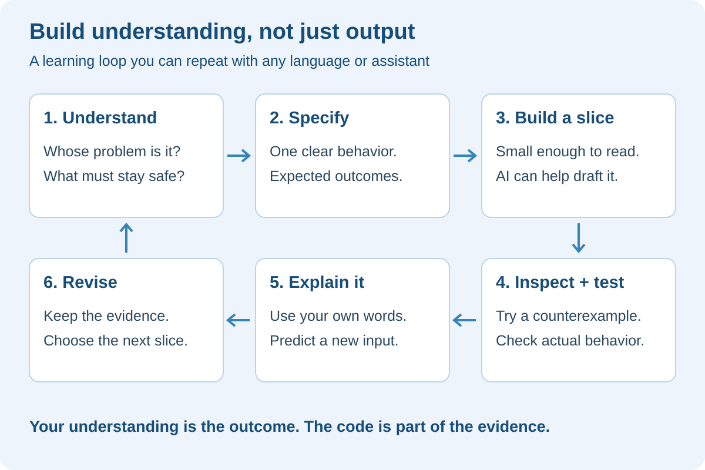
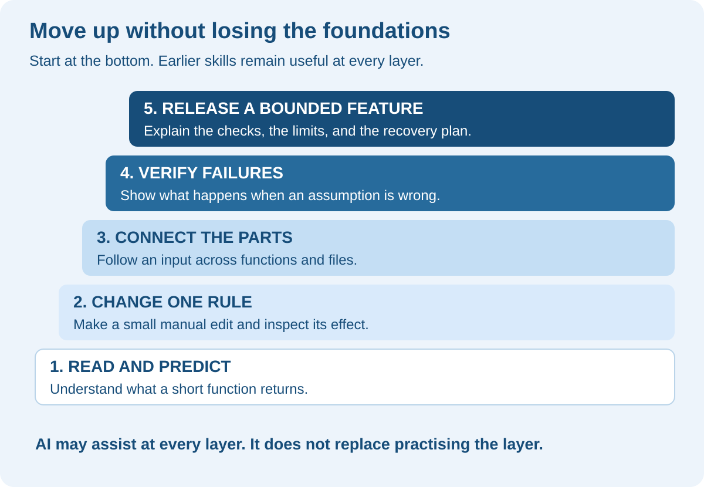
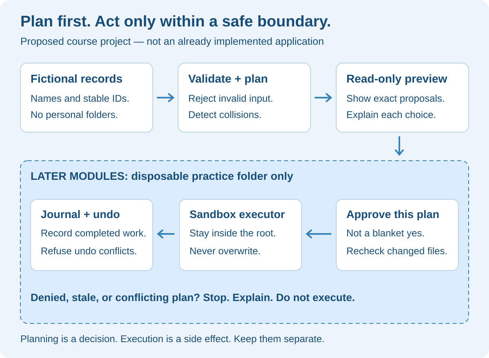
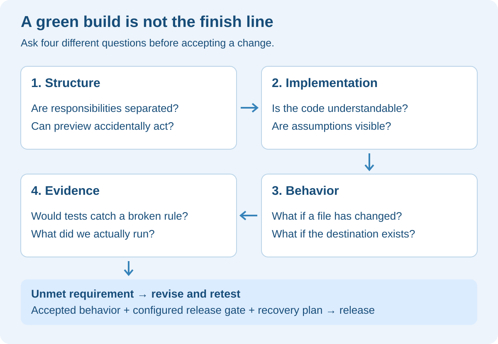

# Coding with Confidence: Become the Builder, Not Just the Typist

## At a glance

**A practical course outline for returning to software development with AI beside you—not in place of your understanding.**

You do not need to prove that you can out-type an AI model. This course is about being able to say: “I understand the problem. I can follow the code. I can change it safely. I can show you why it works—and where it does not.”

You already have subjects you care about: useful file automation, trustworthy agents, and safe information sharing. We will use those interests instead of sending you back to months of disconnected syntax exercises. At the same time, we will not pretend you can review a system well without learning how its code behaves.

**Format:** 12 core modules, followed by 3 optional AI-system extensions. Each module contains three proposed lessons, a practical assignment, an explain-it-back exercise, and a small piece of evidence you keep. This document is the course blueprint and includes a first exercise; it is **not yet the complete set of lesson workbooks or an implemented FilePilot application**.

**Suggested pace:** two to four sessions per module, usually 30–60 minutes each. Adjust freely. This is a planning estimate, not a deadline or promise of proficiency. The first exercise can be done on paper; the later Python exercises need a local interpreter, editor, terminal, and eventually Git. Paid AI tools and live model API calls are not prerequisites for the core path.

**Starting project:** FilePilot Mini, a new learning implementation that begins with fictional file metadata. It is separate from the website's existing mission simulations. We will not point it at your personal folders.

> The goal is not “I never get stuck.” The goal is “When I get stuck, I know a small, safe step I can take next.”

## What the video gives us—and what we change

The supplied Aish Reganti transcript encourages moving beyond typing toward problem definition, specifications, review, and domain understanding. Those ideas shape this curriculum. We add explicit code-reading and manual practice so “directing AI” does not become “accepting output I cannot assess.”

Some of the video's historical and labor-market claims need qualification. COBOL was a consortium effort, not simply an IBM launch; the claim that specialties are disappearing is not established; and a personal hiring account does not describe every employer. The companion [video fact-check](VIDEO-FACT-CHECK.md) contains timestamped assessments and primary-source links.

For this course, the useful conclusion is narrower and stronger: **AI can help you practise engineering, but it cannot supply your understanding merely by producing a finished application.** A 2026 study of learning a Python library found weaker quiz performance with AI assistance in that setting; how participants engaged with it mattered. That is why our design includes prediction and teach-back, not just generation. [Anthropic's learning study](https://www.anthropic.com/research/AI-assistance-coding-skills).

## The new working agreement



### What the diagram teaches

Start with a person's need, not a stack. “I want to organize my downloads” is a request, but not yet a safe specification. Who owns the files? Are duplicates safe to delete? Is a folder name sensitive? These questions decide the product before a framework does.

Next, write down one small behavior. Ask AI to help draft or challenge it, then choose the rule yourself. Build only enough to make that rule observable. A function that returns a proposed destination is enough for the first version; it does not need a dashboard, agents, or cloud infrastructure.

Then inspect the result. Predict an output, run the example, and investigate any disagreement. Finally, explain the rule in your own words. If you cannot explain one part, shrink that part and study it. Returning to an earlier step is normal—it is how the loop produces learning.

| You remain responsible for | AI can help with | Evidence before moving on |
|---|---|---|
| Choosing the problem and limits | Asking questions and suggesting alternatives | A short requirement with an explicit non-goal |
| Understanding the chosen rule | Explaining code and drawing a data flow | Your prediction for a new input |
| Accepting or rejecting a change | Drafting a small implementation and tests | A reviewed diff and an observed result |
| Deciding what is safe to release | Finding risks and drafting release notes | Acceptance checks and a recovery plan |

These are learning responsibilities, not a claim that one person should replace a whole engineering team. Security, operations, accessibility, and domain specialists still provide expertise you may need.

## Build understanding in layers



### What the diagram teaches

Moving “one level up” does not mean discarding the lower levels. A person reviewing architecture still needs to follow a condition, a loop, and an error path. A person approving a release still needs to understand what a failing test means.

We start with Python because it fits your file-automation interests. Stay with one language through the core path. The optional website interface can come later; learning Python, TypeScript, React, cloud hosting, and three agent protocols at once would make it harder to identify which part you understand.

You can use documentation at every level. The brief unaided moments are for noticing what you know, not for recreating a closed-book interview or proving that tools are cheating.

## The project that ties the course together

FilePilot Mini helps a fictional studio organize example documents. The owner wants a list of proposed moves, an explanation for each choice, and a way to refuse or reverse an action. In early modules, “files” are just records such as a name and a category. Later, a separately created disposable fixture folder provides actual test files.



### What the diagram teaches

The **planner** decides what should happen without changing files. That separation makes it easy to ask, “What would you do?” without risking “What have you already done?” A **validator** checks whether inputs meet the rules. A **preview** shows the human the exact proposal.

The later **executor** performs an approved operation only inside a disposable practice folder. Approval belongs to a specific plan, not a permanent “yes” to anything the program later decides. If a file changes after preview, the execution step must detect that and refuse or request a fresh plan. A **journal** records enough about completed actions to attempt recovery; undo must also refuse to overwrite a newly created file.

This architecture is our proposed teaching design. The diagram is not evidence that these components have already been implemented. The existing FilePilot website missions remain simulations and do not operate on your actual files.

### The milestones—not a giant first build

| Milestone | What exists | What is deliberately absent |
|---|---|---|
| A: Understand | A tiny classification function and examples | Filesystem changes, AI calls, cloud hosting |
| B: Plan | A validated list of proposed moves | Permission to execute those moves |
| C: Practise safely | An executor and journal for disposable fixtures | Personal folders, deletion, unattended automation |
| D: Demonstrate | A tested release and a clear walkthrough | Claims of production certification |
| Optional extensions | Restricted tool access, evidence retrieval, a specialist handoff | A requirement to use agents for simple rules |

## Core course: twelve modules

### Module 1 — Restart with a small success

**Question:** What counts as my work when AI helped?

**Lessons:** 1. Separate typing from understanding. 2. Predict the result of a tiny function. 3. Describe a result without borrowing the assistant's explanation.

**Practice:** use the first-session exercise below. Classify five fictional names and explain the rule. List one thing it cannot do, such as confirming a file's true contents from its extension.

**AI role:** explain unfamiliar words and give hints after your prediction. Do not ask for the next ten features.

**Your evidence:** five expected outputs, the actual outputs if you run it, and a two-sentence explanation. **Move on when:** you can classify one new example correctly and explain why. If not, repeat with fewer examples; that is not a failed course.

### Module 2 — Read Python without trying to memorize Python

**Question:** How does an input become an output?

**Lessons:** 1. Values, strings, lists, and dictionaries. 2. Conditions, loops, and functions. 3. Return values, exceptions, and side effects—a change outside the function's returned answer.

**Practice:** manually change a classifier to handle a new category. Trace the value of each variable through two inputs. A list of three file records is enough.

**AI role:** explain a line only after you have described your best guess. Ask it to quiz you with a different input, not repeatedly restate the same answer.

**Your evidence:** a before/after code diff and a hand-drawn trace. **Move on when:** you can change one condition and predict both the intended effect and a possible unintended effect.

### Module 3 — Explore a codebase without drowning in it

**Question:** Where should I look first?

**Lessons:** 1. Locate the entry point, data definitions, and tests. 2. Follow one request across files. 3. Distinguish observed behavior from an AI's plausible description.

**Practice:** inspect a small existing FilePilot mission or a workshop example. Follow just one input and decision. Label simulation code as simulation code. Draw a three-to-five-box map before proposing changes.

**AI role:** point to exact functions and explain their callers. Verify its claims in the source. For external open-source examples, read the license before reusing code and inspect install scripts before running them.

**Your evidence:** a codebase map and one claim checked against the actual code. **Move on when:** you can identify where one rule lives and where its result is consumed. Companion: [Reading an Unfamiliar Codebase](../codebase/READING-AN-UNFAMILIAR-CODEBASE.md).

### Module 4 — Turn a vague request into a testable specification

**Question:** What exactly would count as correct?

**Lessons:** 1. Write the six fields from the video. 2. Add exclusions and failure behavior. 3. Turn examples into acceptance checks—observable conditions for accepting a feature.

**Practice:** specify a read-only move planner. It must not change anything, must reject invalid records, and must report a name collision. Use the worked specification later in this outline as a model, not as a substitute for your decisions.

**AI role:** challenge the spec with missing cases. You choose the final rule and record why.

**Your evidence:** one page of requirements plus at least five examples with expected outcomes. **Move on when:** another person could tell whether the planner meets your requirements without asking what “works well” means.

### Module 5 — Build one small slice with AI

**Question:** How do I stay in control while accepting help?

**Lessons:** 1. Limit a request to one behavior. 2. Review the diff—the exact lines changed. 3. Stop when the change becomes too large to understand.

**Practice:** ask AI to implement only the planner from Module 4. Keep file reads and writes outside the pure planning logic. Review each changed file and reject unrelated cleanup or new dependencies that do not serve the spec.

**AI role:** produce a bounded draft and explain alternatives. If the patch is too large, ask for a smaller slice rather than accepting it because it looks polished.

**Your evidence:** a small patch, a list of accepted decisions, and one rejected suggestion. **Move on when:** you can explain every public input, output, and side effect of the slice.

### Module 6 — Test the requirement, not the assistant's story

**Question:** Could the code and its tests agree and still be wrong?

**Lessons:** 1. Expected results come from the spec. 2. Test normal inputs, boundaries, and forbidden actions. 3. Deliberately break a rule and make sure a test catches it.

**Practice:** check empty input, mixed-case extensions, unsupported records, duplicate destinations, and absence of writes. Introduce a tiny temporary fault, such as allowing a collision, observe a relevant failure, and restore the correct implementation.

**AI role:** suggest missing tests only after you have written expected results. A second assistant may help review, but it is not proof of independence or correctness.

**Your evidence:** a requirement-to-test table and a red-to-green example. **Move on when:** at least one test rejects an intentionally incorrect implementation for the right reason. Companion: [Testing That Catches Real Problems](../testing/TESTING-THAT-CATCHES-REAL-PROBLEMS.md).

### Module 7 — Debug without handing away the investigation

**Question:** What is the smallest observation that could tell me what is wrong?

**Lessons:** 1. Reproduce the failure. 2. Trace one input and form a hypothesis. 3. Change one thing and verify the explanation.

**Practice:** investigate a misclassified mixed-case filename or a missing record. State expected and actual behavior before changing code. Add a regression test—a check that prevents the same bug returning.

**AI role:** offer two hypotheses and one diagnostic check, not an immediate rewrite. You choose the check and interpret its output.

**Your evidence:** a short bug report with cause, fix, and regression evidence. **Move on when:** you can explain why the fix addresses the cause rather than merely hiding the symptom. Companion: [Debugging Without Guessing](../debugging/DEBUGGING-WITHOUT-GUESSING.md).

### Module 8 — Review the system at four levels

**Question:** What should make me hesitate before accepting a change?

**Lessons:** 1. Architecture and responsibilities. 2. Code constructs and assumptions. 3. Logic and test evidence.

**Practice:** review a candidate change that mixes planning with file moves. Explain why a preview operation should not secretly execute the plan. Compare a simpler separation of responsibilities with an unnecessary class hierarchy.

**AI role:** propose a design and defend its trade-offs; you still inspect the implementation. Use original playbooks as questions, not as a badge saying the code is now senior-quality. [Google's code-review guidance](https://google.github.io/eng-practices/review/reviewer/looking-for.html).

**Your evidence:** a review note identifying one concrete risk and a simpler alternative. **Move on when:** you can connect a review comment to observable behavior, not just a style preference. Companion: [Software Design and Refactoring](../refactoring/SOFTWARE-DESIGN-AND-REFACTORING.md).

### Module 9 — Make file operations safe to practise

**Question:** What could go wrong between preview and execution?

**Lessons:** 1. Restrict operations to a disposable practice root. 2. Bind approval to an exact plan and recheck state. 3. Journal completed actions and handle recovery conflicts.

**Practice:** use freshly created fixture files, never personal folders. Test a changed file, an existing destination, an interrupted sequence, a repeated request, and an undo collision. Reject traversal outside the root and exclude symlinks/junctions in this learning version. Do not implement deletion.

**AI role:** help construct adversarial fixtures and explain containment checks. Treat this as a bounded training design, not a race-proof filesystem security boundary for hostile multi-user systems.

**Your evidence:** a safety table and a demonstrated refusal. **Move on when:** you can show that a denied operation leaves the fixture unchanged and explain why an undo might legitimately be refused.

### Module 10 — Use Git and review as safety tools

**Question:** How would I hand this change to a teammate?

**Lessons:** 1. Branches, commits, and small diffs. 2. Pull-request descriptions and review feedback. 3. Resolve a conflict and explain a rollback.

**Practice:** package one feature on a branch with its requirement, test evidence, and known limitations. Review it before merging. In solo practice, write a clearly labeled self-review; do not pretend it is an independent teammate's approval.

**AI role:** draft a summary from the actual diff. You verify the summary and check that no secrets or fixture data meant to stay private are included.

**Your evidence:** a review-ready change and a recovery rehearsal. **Move on when:** you can identify the exact version you would restore and what restoring code would not undo. Companion: [Git Collaboration and Review](../git-team/GIT-COLLABORATION-AND-REVIEW.md).

### Module 11 — Release a complete feature, not merely compiling code

**Question:** How do I stop an incomplete feature reaching users?

**Lessons:** 1. CI runs checks; it cannot infer missing business requirements. 2. Preview/staging separates evaluation from production. 3. Approval, release notes, and rollback complete the delivery story.

**Practice:** add an acceptance test for “no overwrite.” Show an incomplete implementation failing it even though it builds. In the future implementation, connect required checks to protected merge/release paths and ensure no alternative production path bypasses the gate. GitHub and hosting configuration must be checked together; a failing test alone does not automatically block every deployment.

**AI role:** explain the workflow and help draft it. You inspect which event triggers it and what actually prevents release.

**Your evidence:** a rejected candidate and a passing candidate, clearly distinguishing local rehearsal from an actual hosted deployment. **Move on when:** you can explain exactly which configured control stopped release. Companion: [CI/CD From Solo to Team](../ci-cd/CI-CD-FROM-SOLO-TO-TEAM.md).

### Module 12 — Demonstrate ownership and plan your next step

**Question:** Can I explain this project without hiding behind the tool?

**Lessons:** 1. Present the user problem and architecture. 2. Demonstrate a failure and recovery. 3. Describe trade-offs, AI assistance, and remaining work honestly.

**Practice:** record a five-minute walkthrough. Show a normal plan, a collision refusal, a failing test, and a recovered fixture. Then take a new requirement—such as a new file category—and describe the smallest safe change before asking AI to implement it.

**AI role:** act as a reviewer who asks questions. Ask it to identify vague claims in your explanation, not inflate your accomplishments.

**Your evidence:** a README, a small architecture diagram, release evidence, and an honest assistance statement. **Finish the core when:** you can explain, modify, test, and recover this bounded system. That is a useful milestone, not a guarantee of employment or production readiness.

## Optional extensions: add complexity only for a reason

These modules are a proposed next stage. Reuse your existing courses to study protocol details at implementation time. Do not add all three simply because they are fashionable.

### Module 13 — MCP: expose a narrowly scoped tool

**Lessons:** 1. Separate a tool interface from its implementation. 2. Define inputs and outputs. 3. Enforce access in the server, not in a prompt.

**Build:** expose a read-only preview operation over fictional records. **AI role:** explain the adapter and its contract. **Your challenge:** submit malformed input and an unauthorized operation. **Evidence:** both are refused by application logic, not merely discouraged in instructions. Do not expose arbitrary shell commands or unrestricted filesystem access. MCP is the tool-connection layer, not an automatic permission system.

### Module 14 — RAG: retrieve an allowed policy before answering

**Lessons:** 1. Retrieve relevant passages. 2. Show sources and handle missing evidence. 3. Restrict retrieval before generating an answer.

**Build:** answer “Why would this file go here?” using a tiny fictional organization policy. **AI role:** help evaluate retrieved passages. **Your challenge:** remove the supporting rule or supply a conflicting version. **Evidence:** the system admits missing/conflicting support rather than fabricating authority. Begin with simple search before adding embeddings or a vector database. RAG adds evidence; it does not make every answer true.

### Module 15 — A2A: delegate a bounded task

**Lessons:** 1. Define a specialist's responsibility. 2. Validate the returned result. 3. Handle timeout, refusal, and partial work.

**Build:** ask a simulated specialist to classify a document while the main workflow retains approval authority. Implement a real protocol exchange only after the mock contract is understood. **AI role:** generate failure scenarios. **Your challenge:** return an invalid category or time out. **Evidence:** the main workflow refuses unsafe execution. Compare this with a plain function; retain delegation only if it solves a real coordination need.

After these extensions, transfer one idea to Acme or a synthetic Hospital example. For Hospital, use fictional records and policies only; completing an exercise is not clinical, legal, or compliance qualification.

## Your first session: one rule you can explain

**Time box:** about 30–45 minutes, or stop earlier after one useful observation. This is a preview exercise, not a test of your worth. No packages, API keys, or file access are involved.

Read this code before running it:

```python
def proposed_folder(name):
    if not isinstance(name, str) or not name.strip():
        return "needs-review"
    clean_name = name.strip().lower()
    if clean_name.endswith(".pdf"):
        return "documents"
    return "needs-review"
```

`def` introduces a function: a named piece of work. `name` is its input. `isinstance` checks the kind of value. `strip` removes surrounding whitespace; `lower` changes letters to lowercase. `endswith` checks a suffix. `return` sends an answer back. No line opens, moves, or deletes a file.

1. Predict the output for `"invoice.pdf"`, `"SCAN.PDF"`, `"notes.txt"`, `"   "`, and `None`.
2. Say why uppercase PDF names work. Say why `None` does not reach the string operations.
3. If you have Python available, paste the function into its interactive prompt and call it with each input. Compare your observations with your predictions. If not, tracing it on paper is enough to begin.
4. Manually add a rule that `.txt` names return `"text-notes"`. Ask for a hint if needed, rather than the completed change.
5. Explain why `"malware.pdf"` would still be categorized as documents. A name suffix does not verify contents or safety. This function proposes a label, not permission to trust or execute a file.

**Answer check—read after predicting:** the original function returns documents, documents, needs-review, needs-review, needs-review, in that order. After your change, `"notes.txt"` should return text-notes. These are expected outcomes for the exercise, not a claim that you have run it.

**Teach-back:** “The function normalizes a non-empty string, checks a filename ending, and returns a category. It has no filesystem side effects. It does not prove the file's real format.” Use your own words rather than memorizing this sentence.

**Small independent challenge:** predict the answer for `"report.pdf.exe"`. Then identify one new test you would add before relying on your change.

## A worked six-field specification

This is a proposed Module 4 assignment. It adds specific boundaries to the video's starter template.

| Field | FilePilot Mini: read-only preview |
|---|---|
| Goal | Help a fictional studio see proposed organization changes without changing files. |
| Inputs | A list of records, each with a unique ID and a non-empty filename string, plus an explicit list of occupied destination names. No actual paths or file contents. |
| Outputs | A proposal per valid record: ID, category, suggested destination, and reason; invalid records produce a structured rejection. |
| Edge cases | Empty list returns an empty plan. Duplicate IDs reject the request. Unsupported extensions require review. Duplicate proposed destinations and already occupied destinations block the affected moves. Define comparison as case-insensitive for this exercise. |
| Definition of done | Expected outcomes are specified before implementation; tests cover each rule; a deliberate collision bug is caught; preview performs no file or network writes; the learner can trace one record end to end. |
| Constraints | Fictional metadata only. No deletion, real folders, external services, hidden dependencies, or automatic execution. Keep planning separate from I/O. |

**Open question to resolve before building:** should one invalid record reject the whole request or only that record? Here, duplicate IDs reject the request because identity is ambiguous; other invalid records are individually rejected. Write this down so the tests do not accidentally invent the product policy.

**Additional release question:** if a later executor fails halfway through, how do we know which operations completed? That belongs to the journal and recovery design in Module 9, not a silent assumption in the preview feature.

## How to review before saying “done”



### What the diagram teaches

A green build answers a limited question: can the toolchain produce the application? It does not know whether a privacy requirement is missing or an undo button is decorative. Each gate asks a different question.

At the structure gate, check responsibilities: why can a preview function write files? At the implementation gate, check whether a simple rule has become an elaborate framework. At the behavior gate, try a collision and a stale approval. At the evidence gate, ask whether the tests would actually fail if the code violated the rule.

Release only through the agreed path, with explicit acceptance checks and a recovery plan. Some checks are automated; others require a person's judgment. Do not rename an assistant's self-review “independent approval.”

## How we will use AI in learning sessions

### Tutor mode: explain without taking over

> I am learning, not trying to finish as fast as possible. Ask me to predict the output first. Explain one concept at a time in plain English. Give a hint before giving finished code. After the explanation, ask me a different example to check my understanding.

### Specification partner: challenge my assumptions

> Here is my six-field specification. Identify ambiguities, unsafe side effects, and three missing examples. Do not implement yet. Separate facts from assumptions and ask me to choose the product rules.

### Bounded builder: one understandable change

> Implement only this agreed behavior. Keep the patch small, list changed files, and explain inputs, outputs, and side effects. Do not add dependencies or touch unrelated code without explaining why. Stop if the change would exceed the agreed scope.

### Reviewer: show evidence, not reassurance

> Compare this diff with the specification. Identify concrete failure cases and point to the relevant code. Distinguish tests actually run from tests you recommend. Do not call it production-ready because it compiles. Ask me to explain one risky decision before we accept it.

These prompts are teaching aids, not security controls. Use actual permissions and application checks to limit what a tool can do. If the assistant still gives an overwhelming answer, ask for a single function and a single example.

## A routine for days when confidence is low

Reduce the scope, not the standard of evidence. Instead of “build the whole feature,” choose “explain why this branch ran.” Instead of “learn authentication,” choose “trace where this request is rejected.” You may finish a session with a clearer question rather than a completed feature.

Try a 45-minute structure: five minutes to recall yesterday's rule, ten to inspect one example, fifteen to change or test something, ten to explain the result, and five to write the next smallest step. The exact timing is optional. Stop and take a break if you are circling the same problem without new evidence.

Keep a tiny evidence note if useful: **what I expected; what happened; what I can now explain; what remains unclear.** This is not a score, streak, progress bar, or public ranking. It is a way to avoid forgetting the small things you genuinely learned.

If AI is unavailable, continue with prediction, tracing, tests, documentation, or explaining an existing diff. If you feel dependent on it, do one tiny edit before requesting help. Assistance is allowed; invisible gaps in understanding are what we want to make visible.

## What to postpone

Do not start by learning every framework, building a multi-agent platform, or comparing yourself with people posting finished demos. Postpone paid model APIs, embeddings, Docker, distributed services, and a polished React interface until a specific requirement makes them useful. This is an ordering decision, not a claim those skills lack value.

Twelve-Factor becomes relevant when you start designing a service with configuration, dependencies, logs, and separate environments. It is not a checklist that automatically turns a local script into production software. [Twelve-Factor methodology](https://12factor.net/).

## What success will look like

At the end of the core, you should have a small, bounded project you can demonstrate honestly. You can describe its purpose, explain its functions, find a bug, reject an unsafe change, and show what remains unfinished. Your README can say which parts AI drafted and which decisions and checks you performed.

That is a more useful basis for confidence than telling yourself you must already be a senior engineer. The course cannot promise a job, a particular income, or a feeling on a deadline. It can give you repeated chances to turn “I hope this works” into “Here is what I checked.”

**Begin with the first-session exercise. You do not need to earn the right to start by knowing everything first.**
