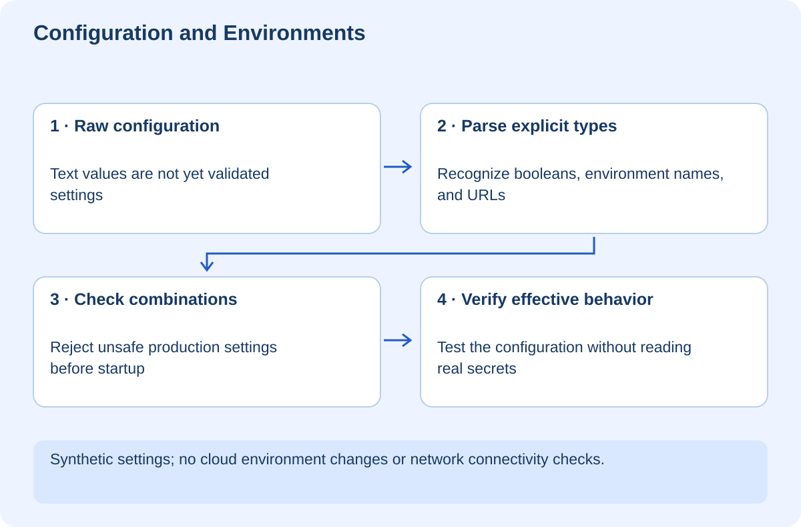

# Configuration and Environments — Know What You Are Running

## At a glance

This workshop teaches you to separate code from deployment settings and to reject dangerous configuration before serving requests. The lab parses synthetic settings for development, staging, and production. It catches a misspelled environment, an invalid boolean, and unsafe production combinations without reading your real environment or contacting a service.

Use Python 3.10 or newer. Run `python lab.py` from `exercises`. The assertions demonstrate configuration behavior; they do not create or configure cloud environments.



## Lesson 1 — Same source does not mean same behavior

Imagine the same application commit runs correctly on your laptop but connects to the wrong API in staging. The code may be identical while the effective configuration differs. An environment is more than a branch name: it includes settings, credentials, data, dependencies, and infrastructure.

Development is your local working setup. Staging is a controlled rehearsal. Production serves real users. These should have deliberately chosen boundaries. A staging URL pointing at a production database is not isolated just because the browser address contains “staging.”

Record the source version, dependency versions, configuration names, and service destinations when investigating differences. Never print credential values to make that inventory convenient.

**Checkpoint:** Name three things that can differ between two deployments of the same commit.

## Lesson 2 — Parse strings into meaning

Environment values normally arrive as text. The string `false` is not the boolean false in many languages. In Python, `bool("false")` is true because the string is not empty. JavaScript has the same trap with a truthy nonempty string.

Read the lab's `load()` function. It accepts a mapping rather than reading global environment state, which makes tests deterministic. It recognizes only `true` or `false`, converts deliberately, and rejects other spellings. The application environment also has an allowlist, so `prodution` does not silently become development.

```python
raw = values.get("DEBUG", "false").lower()
if raw not in {"true", "false"}:
    raise ValueError("DEBUG")
debug = raw == "true"
```

A default is a policy decision. A harmless local port may have a default; a production database destination often should not. Ask whether missing configuration should stop startup rather than cause a surprising fallback.

## Lesson 3 — Validate combinations, not only fields

An individually valid setting can become unsafe in combination with another. Our lab permits HTTP locally but requires HTTPS in production and refuses production debug mode. That models a startup gate, not a complete security policy.

The URL parser checks that a supported scheme and hostname exist. It does not prove the destination is trustworthy, that TLS is configured correctly, or that the destination belongs to the intended organization. A production system may need explicit destination allowlists and infrastructure controls.

Run the lab, then add a setting for a request timeout. Define units and a sensible range before parsing it. Test zero, a negative value, a huge value, and nonnumeric input. Avoid a configuration that technically parses but causes every request to hang for hours.

**Checkpoint:** Explain why failing startup can be safer than starting with a silently substituted production destination.

## Lesson 4 — Separate build-time and runtime settings

Some frameworks replace public variables during the build. Changing a server environment variable afterward may not change JavaScript already shipped to browsers. Other settings are read when a process starts or on each request. Know which category applies before diagnosing a stale value.

A frontend API base URL is not necessarily secret. A service credential is. Public configuration must not contain private credentials, regardless of its variable name. Inspect the actual boundary: does this value become part of a browser-delivered asset?

Keep a documented configuration schema listing name, purpose, required environments, default policy, secrecy, and when it is read. An example file should contain placeholders or harmless synthetic values, never a working token.

Dependency lockfiles are another part of reproducibility. They record resolved package versions, while the runtime version and operating system still influence behavior. “It is in Git” alone does not describe a reproducible environment.

## Lesson 5 — Rehearse a bad deployment without deploying

Create a synthetic production mapping with `DEBUG=true`. The loader must reject it. Now set `DEBUG=false` but leave the default HTTP address. It must still reject it. Finally supply the harmless HTTPS example destination used in the test; parsing should succeed without making a network request.

These experiments demonstrate configuration validation only. The example.invalid domain is intentionally not a real application endpoint. Successful parsing does not mean a service is reachable.

For a real deployment, add a separate health check for connectivity and dependencies. Do not conflate “the configuration is well formed” with “the dependency is healthy.” Keep startup checks bounded so a failed dependency does not create an endless boot loop with no useful error.

## Lesson 6 — Your independent challenge and handoff

Add a synthetic `DATASET` setting with separate allowed names for staging and production. Test that staging cannot select the production dataset. Explain why this application-level check complements, rather than replaces, separate credentials and infrastructure permissions.

Write a handoff table for your real website: Node version, build command, public settings, server-only settings, storage destination, and verification method. Record names and purposes, not secret values.

The lab verifies explicit boolean parsing, environment names, basic URL structure, and production combination rules. It does not alter Vercel settings or inspect actual secrets. You are finished when you can explain the effective configuration before you run or deploy a project.
