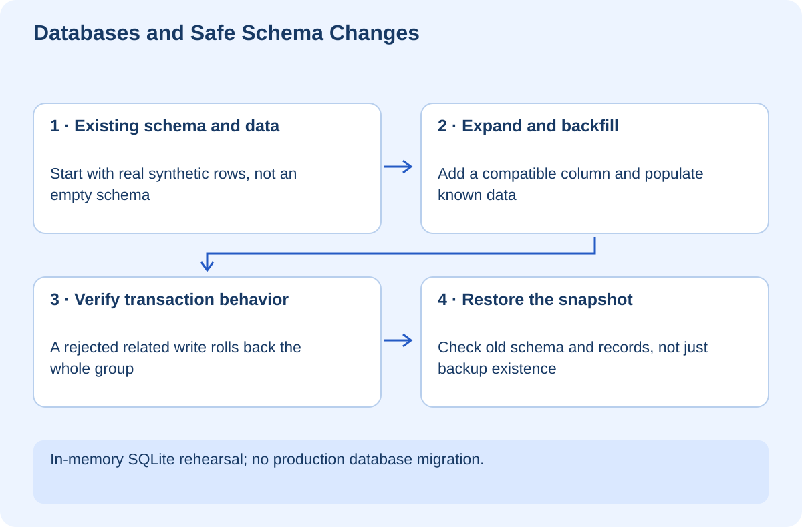

# Databases and Safe Schema Changes

## At a glance

This workshop teaches you to change stored data without assuming that a new application build can magically repair an old database. You will model lessons and progress, enforce relationships, add a compatible column, backfill existing data, observe transaction rollback, and restore a backup. The runnable exercise uses Python's built-in SQLite support and keeps every database in memory.

You need Python 3.10 or newer. No database server or real customer data is involved. SQLite is the teaching engine; migration locking, online index creation, concurrency, and operational procedures differ between database products.



## Lesson 1 — Model facts, not screens

A table stores one kind of fact. A row represents an instance. A primary key identifies it. A foreign key expresses a relationship to another table. A constraint rejects data that violates an agreed rule even if an application forgets to check it.

Our lessons table stores an ID and unique title. Progress rows refer to a lesson and contain a completion flag restricted to zero or one. A progress row for lesson 999 should not exist unless that lesson exists. Otherwise your interface could display progress for something that cannot be opened.

Do not put every screen field into a single giant table just because the screen shows it together. Conversely, do not split every value into a separate table without a reason. Start with identity, relationships, update behavior, and the questions your application must answer.

In the lab, SQLite foreign-key enforcement is enabled explicitly on the connection. A schema declaration without active enforcement is not the guarantee you intended. Verify your database's settings rather than assuming defaults.

## Lesson 2 — Read and run the schema

Open `exercises/lab.py`, then run:

```powershell
python lab.py
```

Read the `CREATE TABLE` statements and the parameterized INSERT. The SQL contains placeholders and the values are passed separately. This keeps user data from being interpreted as SQL syntax. Do not build SQL by concatenating raw input.

The script creates FilePilot as an existing record before the migration. That matters: a migration that works on an empty database can still break real installations full of older records. Test both fresh installation and upgrade from a representative previous schema.

A `SELECT` returns data, not necessarily in a stable order unless you ask for one. When order matters, include `ORDER BY`. When uniqueness matters, enforce it with a constraint rather than relying on two clients not writing at the same time.

**Checkpoint:** Explain which rules belong in the schema and which still require application logic.

## Lesson 3 — Expand before you contract

Suppose you want every lesson to have a summary. Adding a non-null column without a value for existing records may fail or require a deliberate default. Our migration adds `summary TEXT NOT NULL DEFAULT ''`, then updates the known record with meaningful text.

The older application can continue reading ID and title. The newer application can read summary. This is the beginning of an **expand-and-contract** strategy: add compatible structure, transition readers and writers, migrate old data, verify adoption, and remove old structure only when nothing still depends on it.

Do not rename a column used by an older deployed process and assume a rolling deployment updates every process instantly. Background jobs, reports, and rollback versions may still use the old shape.

The lab's small transaction is not a model for updating millions of rows in one production transaction. Large backfills may need batches, progress tracking, lock analysis, and retry handling. [SQLite's ALTER TABLE reference](https://www.sqlite.org/lang_altertable.html)

## Lesson 4 — Observe all-or-nothing behavior

The script starts one transaction, inserts valid progress, then attempts progress for a nonexistent lesson. The second write fails. The transaction rolls back both writes, and the final count is zero.

This is a useful guarantee: a group of related database changes can either commit together or not commit. It is not a guarantee about an email or filesystem operation performed halfway through the transaction. External side effects are not automatically reversed when database work rolls back.

Modify a disposable copy so the two inserts happen in separate transactions. Predict the count after the second fails. The first transaction should remain committed. This experiment explains why transaction boundaries are part of application correctness, not just performance tuning.

**Checkpoint:** Describe a real operation in Acme that requires multiple database writes to succeed together.

## Lesson 5 — A backup is not proven until restored

Before the migration, the lab copies the database using SQLite's backup API. Later it restores that snapshot into another connection and checks both records and schema. The restored database has the original two columns, not the migrated summary column.

That is stronger evidence than checking whether a backup file exists. A recovery exercise should verify that the application can use the restored state and that the expected recovery point is acceptable. Restoring an older snapshot can lose valid newer writes; that is a business decision, not merely a command.

Do not copy an actively changing database file casually and assume consistency. Use the engine's supported backup procedure. Keep access restrictions and retention appropriate to the data. The lab's in-memory snapshot teaches mechanics only; it does not provide persistent disaster recovery.

For production planning, record how much data loss is tolerable and how long recovery may take. Then test those assumptions rather than turning them into aspirational numbers.

## Lesson 6 — Your migration review and challenge

Before approving a migration, ask: Does it preserve current data? Can old and new application versions coexist? What locks can it take? Is the backup restorable? What is the forward-fix plan? What does application rollback actually restore?

Your challenge is to add a lesson category with a restricted set of valid values. Test old rows, new valid rows, and invalid input. Decide how existing rows acquire a category and explain whether a default represents truth or merely hides missing data.

The verified lab demonstrates schema expansion, a backfill, foreign-key rejection, transaction rollback, and restoration of an earlier schema/data snapshot. It does not run a production migration or change any database outside the exercise.
