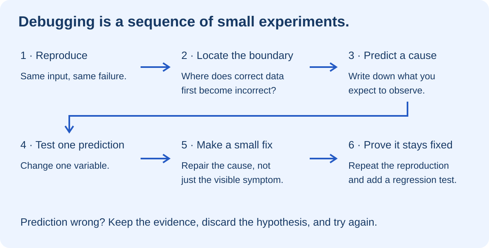
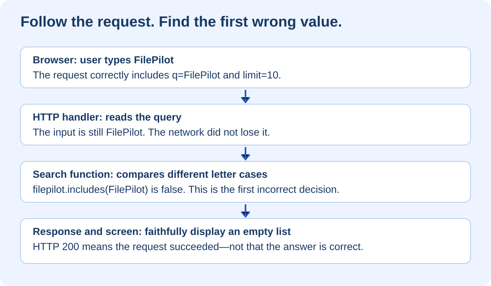

# Debugging Without Guessing

## At a glance

This eight-lesson workshop teaches you to investigate broken software calmly and systematically. You will run a small Learning Library app, reproduce two bugs, inspect an HTTP request, pause server execution, compare actual values with expected values, and write evidence that your fixes work. It follows naturally from the CI/CD workshop: that course taught you how to stop a bad change; this one teaches you how to understand and repair it.

Use Node.js 22 or newer, PowerShell, and a desktop browser such as Chrome with developer tools. The lab uses only Node's built-in modules. No package installation, database, account, cloud service, secret, or deployment is needed. All data is synthetic. Allow several short sessions rather than rushing through the solution.

> **The key idea:** A bug is not a reason to start changing random lines. It is a difference between what you expected and what you observed. Your job is to find the earliest point where those two things diverge.

The supplied starter intentionally contains two bugs. Keep a clean copy so you can repeat the investigation. This course does not modify or deploy your real learning website.

## Lesson 1 — Think like an investigator



### What the diagram teaches

Imagine a learner reports: “I searched for FilePilot, but it isn't there.” You know the lesson exists. Your first instinct might be to rebuild the search index, clear the browser cache, or change the search component. Each could be relevant in some application, but none is justified yet.

First ask for the exact input and the exact outcome. Did they enter `FilePilot`, `filepilot`, or a phrase containing extra spaces? Did the page show an error, show no results, or never stop loading? These are different failures with different likely causes.

Now reproduce the report. Reproduction means a repeatable sequence, not “it happened once.” Write down the starting state, input, action, expected result, and actual result. If you cannot reproduce it, record differences between your environment and the user's environment instead of declaring it fixed.

A **hypothesis** is a proposed explanation that makes a testable prediction. “The code is broken” is not a useful hypothesis. “Only one side of the comparison is converted to lowercase” is useful: it predicts that changing only the input's letter case will change the result.

An **experiment** tests that prediction. A small fix follows only after the evidence supports the cause. A **regression test** preserves the discovery so the same mistake is caught if someone introduces it again.

### Keep a debugging notebook

Use this template for every exercise:

```text
Problem:
Exact reproduction:
Expected:
Actual:
Hypothesis:
Prediction if my hypothesis is true:
Experiment:
Observed evidence:
Conclusion:
Fix and regression test:
Remaining uncertainty:
```

Do not erase a rejected hypothesis. “Cache was suspected, but two fresh requests produce different results solely by changing case” is useful evidence. It explains why you stopped looking in that direction.

**Checkpoint:** Describe the difference between an observation and an explanation. “The response contains an empty list” is an observation. “The database lost the record” is an explanation that still needs evidence.

## Lesson 2 — Run the app and reproduce the failure

### Set up a separate practice folder

The starter is inside this repository at `docs/training/debugging/exercises/debug-lab`. Copy it to a fresh folder outside the learning repository. These PowerShell commands refuse to overwrite an existing practice directory:

```powershell
if (Test-Path -LiteralPath E:\debug-lab) {
    throw 'Choose a new practice folder first.'
}
Copy-Item -LiteralPath E:\image-course\docs\training\debugging\exercises\debug-lab -Destination E:\debug-lab -Recurse
Set-Location E:\debug-lab
npm start
```

Open `http://127.0.0.1:4174` in your browser. Leave the terminal running; Ctrl+C stops the server. If you get `EADDRINUSE`, another process is using that port. Stop your own earlier lab server, not an unfamiliar process. If the browser says connection refused, confirm the server actually started before inspecting application logic.

### Understand the files before editing

```text
debug-lab/
├── package.json    Names the start, test, and debug commands
├── index.html      Form, browser fetch call, result list, and error message
├── server.mjs      HTTP routing, query parsing, response, and request logs
├── search.mjs      Sample lessons, matching behavior, and limit parsing
└── tests.mjs       Small behavior tests and a real local HTTP test
```

There is no build step here. JavaScript runs directly, reducing distractions while you learn the investigation. A syntax check can still pass while the behavior is wrong, just as compilation could pass in the CI/CD course.

### Reproduce Bug A

Leave the limit at 10. Search for `filepilot`, then `FilePilot`. Change only the capitalization, not the limit or code.

| Input | Expected | Initial actual result |
|---|---|---|
| `filepilot` | FilePilot | FilePilot |
| `FilePilot` | FilePilot | No results |
| ` filepilot ` | FilePilot | FilePilot |
| `not-a-lesson` | No results | No results |

The requirement is case-insensitive search with surrounding whitespace ignored. Empty search is defined to show all lessons, subject to the limit. These are product decisions, not universal rules for all search engines.

Notice how much this tiny matrix tells you. The lesson exists, at least one search reaches it, and trimming already works for lowercase input. A missing record is now less likely than a comparison problem.

### Observe the failing tests

In a second PowerShell terminal, enter the practice folder and run:

```powershell
node --check search.mjs
npm test
```

Initially, syntax checking passes. Five tests pass and three fail: the mixed-case search check, the zero-limit check, and the combined HTTP check. The HTTP test stops at its first failed assertion, so it does not yet tell you whether its later assertions would pass.

**Checkpoint:** Reproduce Bug A twice and write a report that someone else can follow without speaking to you.

## Lesson 3 — Follow the request across boundaries



### What the diagram teaches

The browser collects input and sends a request. The server extracts parameters and calls the search function. The function returns matches. The server serializes them into JSON. The browser displays the returned titles.

Each boundary is an opportunity to compare expected and actual values. If the outgoing query is already wrong, investigate the form. If the request is correct but the response is wrong, move toward the server. If the response is correct but the display is wrong, focus on browser rendering.

### Inspect the browser's Network panel

Open the lab in desktop Chrome. Right-click the page and choose **Inspect**, then select **Network**. Keep the panel open and submit `FilePilot`. Select the request whose path starts with `/api/search`. Examine its URL, status, response headers, and JSON response. The Network panel records requests while open. [Chrome's Network panel guide](https://developer.chrome.com/docs/devtools/network/overview)

You should see `q=FilePilot`, `limit=10`, HTTP status 200, and an empty `results` array. The input reached the server correctly. The server successfully handled the request but returned a logically wrong answer. **HTTP 200 is not a certificate of feature correctness.**

The response contains a request ID. The `X-Request-ID` header contains the same ID. Find it in the terminal's JSON log line. This connects one browser request to one server event without relying on approximate timestamps.

### Bypass the browser to narrow the problem

With the server still running:

```powershell
Invoke-RestMethod 'http://127.0.0.1:4174/api/search?q=FilePilot&limit=10' | ConvertTo-Json -Depth 5
Invoke-RestMethod 'http://127.0.0.1:4174/api/search?q=filepilot&limit=10' | ConvertTo-Json -Depth 5
```

These requests reproduce the difference without the form. That is evidence against a form-only bug, not proof that the whole browser is flawless.

Next call the function directly:

```powershell
node --input-type=module -e "import {searchLessons} from './search.mjs'; console.log(searchLessons('FilePilot'));"
```

The function returns an empty list even without HTTP. You have narrowed the investigation from “the website is broken” to one small function. This is a **minimal reproduction**: remove unnecessary layers while keeping the failure.

**Checkpoint:** Explain why an empty API response means you should not begin by changing the list's CSS.

## Lesson 4 — Pause execution and inspect the evidence

### Browser code and server code are different processes

The page's developer tools can pause code running in that page. They cannot automatically pause `search.mjs`, which runs in Node. To inspect server variables, start Node with its debugger enabled.

Stop the normal lab server. Run:

```powershell
npm run debug
```

The command uses `--inspect-brk=127.0.0.1:9229`. It opens a local inspector and pauses before user code begins. In desktop Chrome, open `chrome://inspect`, find the Node target, and choose **inspect**. Resume execution so the server begins listening. Never expose the inspector on a public network; debugger access can control the process. [Node's debugging guide](https://nodejs.org/en/learn/getting-started/debugging)

In the Node debugger's Sources panel, open `search.mjs`. Put a line breakpoint on the `const matches` statement. Submit `FilePilot` in the lab page. Execution should stop before the comparison is evaluated. A line breakpoint pauses at a chosen statement; the debugger exposes local values and the call stack. [Chrome's breakpoint guide](https://developer.chrome.com/docs/devtools/javascript/breakpoints)

### What to inspect

Look at `query`, `needle`, and `limit`. With this request, the values should be `FilePilot`, `FilePilot`, and `10`. Inspect the FilePilot lesson's title. The predicate converts that title to `filepilot`, but leaves the needle as `FilePilot`.

Evaluate these read-only expressions while paused:

```javascript
'filepilot'.includes('FilePilot')
'filepilot'.includes('filepilot')
```

The first is false; the second is true. You have observed the precise incorrect decision. The underlying string operation is doing what it was asked to do. Our implementation failed to express the intended case-insensitive comparison.

**Step over** advances one statement without following every nested call. **Step into** enters a called function. **Resume** continues to the next breakpoint or completion. The **call stack** shows the chain of calls that brought execution here. Use these deliberately; repeatedly clicking controls without a question is another form of guessing.

If the browser keeps waiting while you inspect variables, that is expected: you paused the server before it could answer. Resume it before diagnosing a “slow request.” Debuggers change timing.

### Fix A only after writing the prediction

Prediction: normalizing the query as well as the title should make both letter cases return the same result without breaking the existing whitespace behavior.

Replace this line:

```javascript
const needle = query.trim();
```

with:

```javascript
const needle = query.trim().toLowerCase();
```

Restart Node after saving; this app does not automatically reload server modules. Run the tests. You should now see **six passing and two failing tests**: zero-limit parsing and the HTTP test, which now reaches its zero-limit assertion. This distinction is worth noticing: fixing the first assertion reveals the next failure in the same test.

Repeat the browser searches. A passing function test alone does not prove that the running server has loaded your edited file.

**Checkpoint:** Explain the cause without saying only “I added lowercase.” Explain why one-sided normalization violated the agreed behavior.

## Lesson 5 — Investigate the zero that disappeared

Now enter lowercase `filepilot` and a limit of `0`. The requirement says a zero limit returns zero records. Initially, the app still returns FilePilot.

Inspect the Network request. It includes `limit=0`, so the browser sent the value. Inspect the server log for the same request ID: it records a parsed limit of 10. The wrong value appeared between receiving the parameter and calling the search function.

Open `parseLimit` in `search.mjs`. It converts the incoming string to a number and validates it. Zero passes validation because it is an integer in the allowed range. But the last line says:

```javascript
return value || 10;
```

`||` chooses the right-hand value when the left-hand value is falsy. Zero is falsy. “Falsy” is a JavaScript classification; it does not mean “missing according to our product requirements.” The code has confused a valid value with absence.

The function already handles absence explicitly: `raw === null` returns 10. After validation, simply return the value:

```javascript
return value;
```

Do not mechanically replace every `||` with `??` in the repository. That might be appropriate elsewhere, but first establish the types and requirements at each location. Here the simplest fix is to remove the unnecessary fallback.

Restart the server. Repeat the zero-limit request and run `npm test`. All eight tests should pass. Also try a missing limit: the API should still default to 10. Try `-1`: the API should return status 400. The browser's numeric input helps ordinary users, but direct API callers can bypass it, so the server must validate too.

**Checkpoint:** Show the raw value, converted value, faulty fallback result, and corrected result. Identify exactly where the valid zero was lost.

## Lesson 6 — Logs, errors, and misleading clues

### Log what helps you make a decision

The starter logs request ID, route, parsed limit, result count, and status. It deliberately does not log the raw search query. A real query might contain a person's name, patient information, or confidential text. More logs are not always better logs.

For synthetic local data, temporary diagnostics can be useful. Before adding one, ask what hypothesis it will distinguish. Remove unnecessary diagnostics afterward. Do not print credentials, whole request headers, private documents, or database connection strings.

### Read a stack trace from the relevant frame

A stack trace lists the calls involved when an error occurred. Begin with the first frame in code you own, then inspect its caller and input. A library name in the trace does not prove that the library is defective; your code may have supplied an invalid argument.

Our server catches validation errors and returns a controlled 400 response. That is different from an unexpected server crash. In a production app, separate known input errors from unexpected exceptions, record sanitized internal diagnostics, and do not expose arbitrary exception messages to clients. This lab is a small local teaching server, not a production-ready error-handling template.

### “Works on my machine” is an environment question

Compare source commit, Node version, configuration, data, and exact request. This lab's case bug can appear environment-specific simply because one person types lowercase and another uses capitals. Reproduce the same input before blaming deployment.

For a genuine deployment-only failure, record `git rev-parse HEAD` and `node --version`, verify the intended build and environment, and examine the response. Check for stale assets only when the evidence points there. Clearing everything at once destroys information about which difference mattered.

**Checkpoint:** Write a useful log event for FilePilot that identifies a failed operation without exposing a private filename or file contents.

## Lesson 7 — Prove the fix and connect it to CI

The lab includes unit-level checks for individual functions and an integration check that starts a real HTTP server on a temporary free port. The HTTP check uses the actual routing and JSON response. It still does not exercise the DOM, keyboard navigation, or visual layout. Those need browser checks.

The provided tests make this workshop repeatable, but on your own project you often have to write the failing test. First add an assertion that reproduces the report. Confirm it fails for the intended reason. Apply the smallest justified fix. Confirm it passes, then run related tests and the original manual reproduction.

For this dependency-free lab, a CI job can run `npm test` after checkout and Node setup. Do not copy `npm ci` from another project without a lockfile and dependency setup. For your real website, preserve its existing build, content verification, and installation steps, then add the relevant regression tests.

### A concise review note

```text
Symptom: FilePilot search returned no result for mixed-case input.
Cause: Titles were normalized to lowercase; the query was not.
Change: Normalize the trimmed query before matching.
Evidence: Mixed-case regression test, HTTP test, and browser reproduction.
Separate fix: Preserve an explicit zero limit after validation.
Limitations: This does not implement language-aware Unicode search.
```

Keep fixes separate from unrelated refactoring. A reviewer can reason about a one-line normalization change much more easily than a rewritten search system mixed with styling changes.

**Checkpoint:** Explain what the tests prove, what the browser check proves, and what neither proves.

## Lesson 8 — Your independent debugging challenge

Before looking at any solution, investigate a third edge case: a direct request with `limit=`—an empty value, not an absent parameter. Define a new requirement that this must be rejected with status 400.

The current parser converts an empty string to zero. That means the existing validation accepts it. You have discovered a gap in the input contract, not a regression in the two fixes you already made.

Write a failing parser test and an HTTP assertion. Inspect `raw` before numeric conversion. Decide how whitespace-only input should behave and test that too. Make a small validation change, keep missing-limit default behavior, and rerun the full suite. This challenge is intentionally not solved in the starter or automatic verification.

### Use AI as an investigation partner

A good prompt is: “Here is the exact reproduction, response, relevant function, and failing assertion. Give me two hypotheses and a small experiment to distinguish them.” A weaker prompt is: “Fix everything.” Ask the AI to explain evidence before accepting a patch. Never share private logs or secrets just to get a diagnosis.

### Apply the method to your bigger projects

| Project | Boundary to trace | Useful deterministic check |
|---|---|---|
| Learning website | Search input → index query → article navigation | The expected article ID appears for the known query |
| MCP tool server | Caller → authorization → tool handler | A denied caller never reaches the restricted handler |
| RAG assistant | Identity → allowed documents → retrieved chunks | Restricted chunks are absent before generation |
| A2A workflow | Incoming task → task ID → action record | A repeated task does not repeat the side effect |
| FilePilot | Approved proposal → resolved path → operation | The operation stays within the authorized sandbox |

In AI systems, isolate deterministic code from variable model output. Do not debug an access-control failure by repeatedly changing the prompt until one response looks safe. Locate and test the actual permission boundary.

## Pocket legend and completion checklist

| Term | Plain-English meaning |
|---|---|
| Reproduction | A repeatable sequence that reveals the problem |
| Hypothesis | An explanation with a prediction you can test |
| Breakpoint | A place where execution pauses for inspection |
| Call stack | The chain of function calls that led here |
| Boundary | Where one component passes information to another |
| Request ID | An identifier connecting a request with its logs |
| Regression test | A check protecting against a known bug returning |
| Root cause | The underlying decision or condition producing the failure |
| Falsy | A language rule, not proof that a value is absent |

You are ready to move on when you can reproduce both bugs, narrow each to a function, inspect runtime values, explain each fix, and demonstrate the regression checks. Save your investigation notes alongside your practice work. The useful outcome is not merely a fixed app—it is a method you can repeat on an unfamiliar one.

The HTML edition embeds both diagrams and uses the library's large blue reading style. The starter remains deliberately broken. Cloud deployment and live website settings are unchanged. Tool references were checked on 27 August 2026; browser interface labels can change.
