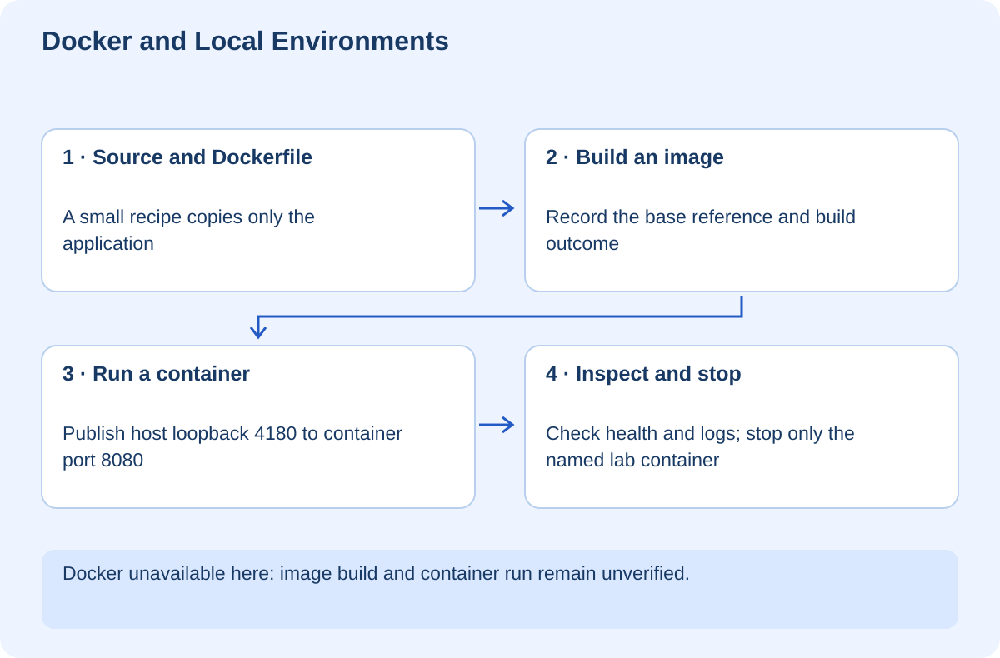

# Docker and Reproducible Local Environments

## At a glance

This workshop teaches you what an image, container, port mapping, and volume actually do. You will package a tiny Python health service, run it through an explicitly local host port, inspect its logs, and understand which changes survive container removal. The supplied service has no database or secrets.

You need a working Docker installation for the container exercises. Docker is not installed in the authoring environment, so image build and container execution are explicitly **not verified here**. The Python service can be checked separately; that does not prove the container works. Do not install or change system software without understanding its platform requirements and licensing.



## Lesson 1 — Separate the recipe from the running process

A Dockerfile is a build recipe. An image is the packaged filesystem and configuration produced from it. A container is a running or stopped instance created from an image. Building an image does not start the service, and stopping a container does not delete the image.

Think of an image as a prepared application package, not a complete virtual copy of your laptop. Containers still depend on a host runtime and operating-system facilities. “It runs in Docker” is not proof that every environment is identical or secure.

The lab contains `app.py`, `Dockerfile`, and `.dockerignore`. The application responds to `/health` on port 8080. It binds to all interfaces inside the container because binding only to container-local loopback would prevent ordinary mapped-port access.

## Lesson 2 — Read the Dockerfile line by line

`FROM python:3.14-slim` selects the base image. `WORKDIR /app` establishes the working directory. `COPY app.py .` copies only the needed source. `USER 65532:65532` runs the application as a non-root numeric user. `EXPOSE 8080` documents the intended container port. `CMD` specifies the process to start.

The version tag is a teaching choice, not an immutable artifact reference. Tags can change. For stronger reproducibility, resolve and review a supported image digest, record it, and maintain an update process. Do not invent a digest in documentation.

The ignore file excludes Git metadata, environment files, and Python caches from the build context. The context is the set of files available to the build; carelessly sending an entire project can expose unnecessary data even when you intended to copy one file.

**Checkpoint:** Explain why `EXPOSE` is not the same as publishing a port on your laptop.

## Lesson 3 — Build and run manually

In the `exercises/container-lab` folder, after confirming Docker is installed and running:

```powershell
docker version
docker build -t learning-container-lab:local .
docker run --rm --name learning-container-lab -p 127.0.0.1:4180:8080 learning-container-lab:local
```

In another terminal:

```powershell
curl.exe -i http://127.0.0.1:4180/health
docker logs learning-container-lab
```

The expected health response is status 200 with the service name. The host port is 4180; the application still listens on 8080 inside the container. Publishing specifically on `127.0.0.1` keeps the mapping local rather than exposing it on every host network interface. [Docker's port-publishing guide](https://docs.docker.com/get-started/docker-concepts/running-containers/publishing-ports/)

If the name already exists, inspect it before acting. Do not delete an unfamiliar container. When finished with your own lab instance, run `docker stop learning-container-lab`. Because it was created with `--rm`, its container is removed after it stops; the image remains.

## Lesson 4 — Understand storage before adding a database

A container's writable layer is not a durable storage strategy. Replacing a container can discard data stored there. A named volume or an explicitly chosen bind mount can preserve data independently, but each has different ownership and host-access consequences.

Do not mount your home directory, whole drive, or Docker socket into a practice container. A bind mount can let the container change real host files. Start with a deliberately created disposable directory and a clear reason for the mount.

For a future database service, distinguish deleting the container from deleting its volume. Avoid broad prune commands or `down -v` without verifying what data they would remove. This workshop does not create a volume, so there is no database data to clean up.

## Lesson 5 — Add services deliberately

A multi-service development setup might include a frontend, API, database, and worker. Each needs a role, internal address, readiness check, and data boundary. Inside one container, `localhost` refers to that container—not another service and not automatically your host.

Compose can describe a group of services, networks, and volumes. It does not remove the need for startup readiness, migrations, credentials, or recovery. A process starting is different from a database being ready to accept the operation your app needs.

Keep this first exercise small before introducing a whole platform. If the single health service fails, diagnose image build, process startup, binding address, and port mapping separately.

## Lesson 6 — Your challenge and verification record

Change the response to include a non-secret configuration value. Rebuild and run a fresh container. Observe that editing a source file on the host does not change code already copied into an existing image.

Record the image reference, build output, health response, and logs. Then stop only your named practice container. A completed Python syntax or HTTP check is not a substitute for these container observations.

The Docker artifacts are ready for your manual rehearsal, but container execution remains unverified until Docker is available and these steps are run. Nothing is deployed to Vercel and no real project is containerized by this document.
