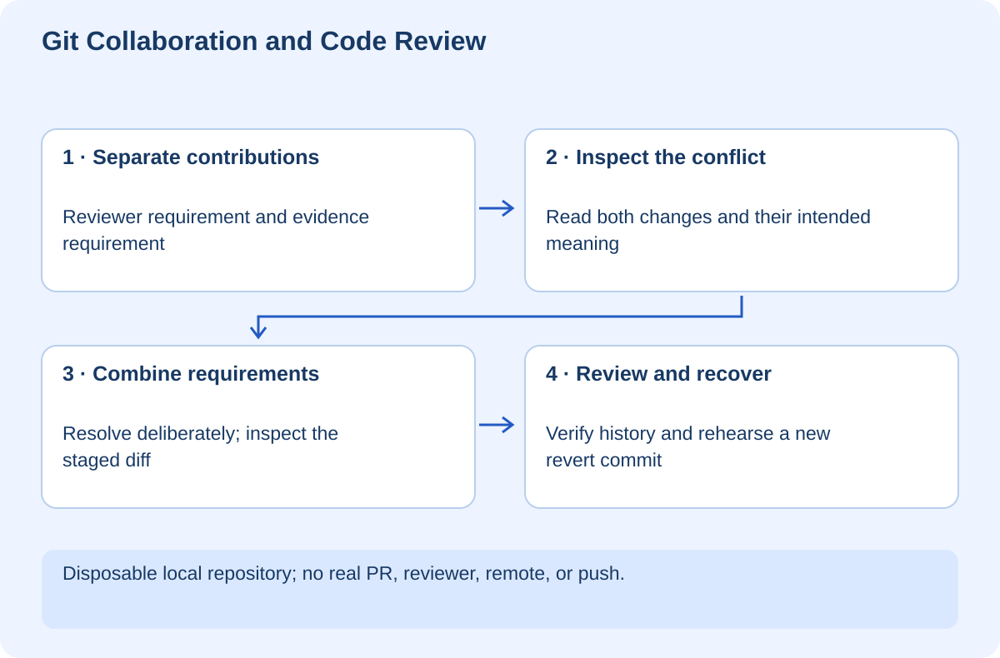

# Git Collaboration and Code Review

## At a glance

This workshop teaches you to work on shared history without treating every disagreement as an emergency. You will create a branch, make focused commits, reproduce a real merge conflict, preserve both contributors' requirements, and undo a bad change using a new commit. A disposable local Git lab verifies the mechanics without pushing anything to GitHub or changing your real repository.

You need Git and Python 3.10 or newer. The supplied script creates its own temporary repository, sets a synthetic identity only for its subprocesses, and removes that temporary repository afterward. It does not use your remote repository. The manual exercise is for a separate empty practice folder.



## Lesson 1 — Understand the shared record

A commit is a recorded snapshot with history information. A branch is a movable name pointing into that history. Your working tree is the editable checkout; the staging area selects changes for the next commit. Neither is a backup of every file on your computer.

Imagine one colleague changes the release policy to require a reviewer while another requires test evidence. Both edits touch the same line. Git can identify the overlap, but it cannot decide the product meaning: should the final policy require both, only one, or something else? That decision belongs to the contributors.

A pull request adds a review conversation around the proposed change. Keep it small enough that a reviewer can understand its intent and evidence. A change mixing a feature, formatting, dependency upgrades, and unrelated refactoring makes failures harder to isolate.

Before editing a shared project, run `git status` and inspect the current branch. Never assume uncommitted changes are yours to discard. If you find another person's work, preserve it and establish the boundary before proceeding.

**Checkpoint:** Explain the difference between editing a file, staging it, committing it, and pushing it.

## Lesson 2 — Rehearse a conflict safely

Run the automated rehearsal from this workshop's `exercises` folder:

```powershell
python lab.py
```

The script creates a real repository, creates divergent changes, asserts that Git reports a conflict, resolves it, and checks that the resulting merge commit has two parents. Its printed graph is the evidence. The temporary history disappears on exit; this is a demonstration, not your long-term practice repository.

For a manual rehearsal, create a new empty directory outside the learning repository and initialize it with `git init -b main`. Configure a suitable identity locally with `git config user.name` and `git config user.email`; do not change global identity for a training exercise. Create `policy.txt` containing `Review: optional`, add it, and commit the baseline.

Create `feature/reviewer`, change the line to `Review: one colleague`, and commit. Switch to main, change the same line to `Review: test evidence`, and commit. Now run `git merge feature/reviewer`. The expected result is a conflict—not lost work.

## Lesson 3 — Resolve meaning, not just markers

Open the conflicted file. Git's markers separate the competing versions. Read both contributions and their commits. For this scenario, the intended policy is `Review: one colleague plus test evidence`.

Replace the conflict block with that sentence, inspect the full file, then run:

```powershell
git diff
git add policy.txt
git diff --cached
git commit -m "Combine reviewer and evidence requirements"
git log --oneline --graph --all
```

The staged diff is your final chance to inspect what the resolution actually commits. Removing markers is not sufficient if you silently discarded one requirement. If this were code, run the relevant tests before committing.

If you decide not to proceed with a merge, `git merge --abort` attempts to return to the pre-merge state. Start merge exercises from a clean tree; combining a merge with unrelated uncommitted changes complicates recovery. [Git's user manual](https://git-scm.com/docs/user-manual)

**Checkpoint:** Explain why blindly choosing “ours” or “theirs” could produce a valid file with the wrong behavior.

## Lesson 4 — Undo without rewriting everyone else's history

Make a new, deliberately bad commit changing the sentence to `Review: unnecessary`. Undo that specific latest commit with:

```powershell
git revert --no-edit HEAD
```

Git creates another commit reversing the change. The shared story remains visible: what changed, when it was found unsuitable, and how it was reversed. A revert may itself conflict if later work overlaps it. [Git revert reference](https://git-scm.com/docs/git-revert.html)

Reset and rebase solve different problems by moving references or rewriting commit sequences. They are not interchangeable with a revert. Do not use hard reset or force push as routine fixes for a shared branch. Before rewriting published history, establish who depends on it and obtain agreement.

Cherry-pick copies a selected change onto another branch; it does not merge the whole branch. It is useful for carefully chosen fixes, but duplicate application and missing dependencies are risks. Practice it only after you can explain which change and dependencies you are carrying over.

## Lesson 5 — Review like a teammate

Read the PR's purpose first, then the code, then its evidence. Ask whether tests exercise the promised behavior, whether permissions remain enforced, and whether error paths are handled. Distinguish blocking correctness concerns from optional style preferences.

A useful comment names the consequence: “This permits an expired approval at the boundary; can we add an exact-expiry test?” An unhelpful comment says only “This looks wrong.” Suggest a way to verify the concern without demanding unnecessary rewrites.

For your own PR, include a short summary, risk, test commands and results, screenshots where relevant, and known limitations. Do not claim tests ran when you only read them. After pushing a revision, check whether earlier approvals and CI results still apply to the latest commit.

## Lesson 6 — Your independent challenge

Repeat the conflict exercise with two nonconflicting edits, then with conflicting behavior in a small function. Notice that Git may merge text automatically even when the combined behavior is wrong. Passing the text merge is not passing the product contract.

Create a review checklist for your FilePilot work: permission checks, sandbox boundary, recovery, and forbidden side effects. Ask another person to review a small synthetic PR when ready; the local lab does not simulate an independent human approval.

Your evidence should include a history graph, a resolved policy containing both requirements, and a revert that restored the intended policy. Nothing in this workshop changes branch protection, creates a PR, or pushes a commit on your behalf.
