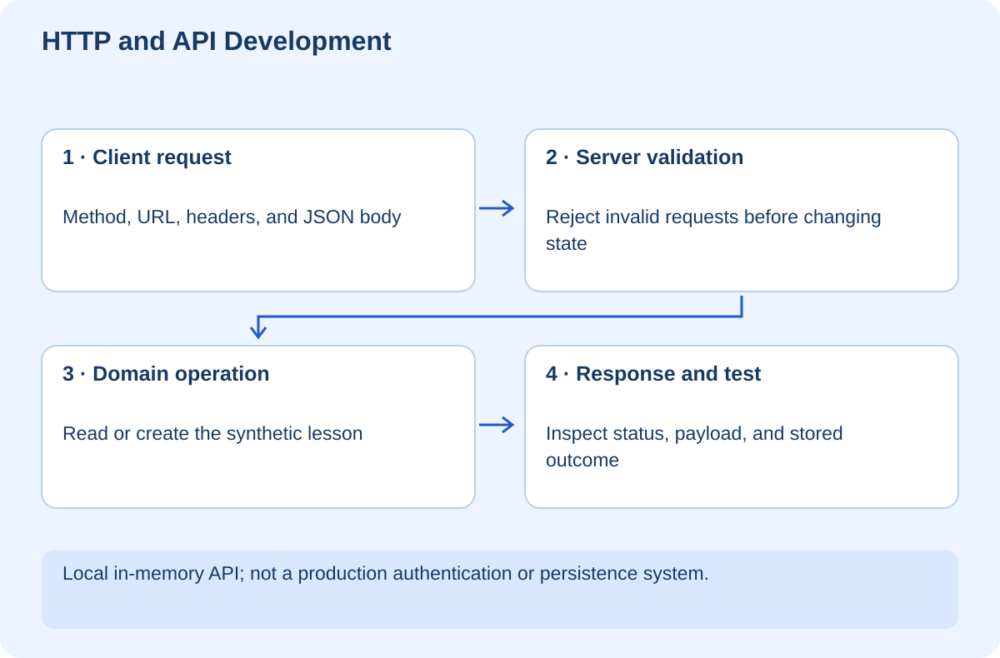

# HTTP and API Development — Conversations Between Programs

## At a glance

This workshop teaches you to read, design, and test the conversations between a frontend and a backend. You will start a local lesson-catalogue API, make requests manually, create a record, deliberately send invalid requests, and explain why the server responds differently in each case. The aim is to understand the exchange, not memorize a list of status codes.

Use Node.js 22 or newer and PowerShell. No installation or cloud account is needed. The app binds only to your local computer and stores synthetic data in memory. Restarting it resets the records. It is intentionally unauthenticated and is not a deployable private-data service.



## Lesson 1 — Read the conversation

An API is an interface another program can use. HTTP is one way programs communicate. The browser is a client; your Node process is a server. The client sends a method, target URL, headers, and sometimes a body. The server returns a status, headers, and usually a body.

Imagine a learner saving a new lesson called FilePilot. The browser cannot simply change the server's memory. It asks the server to create the lesson. The server checks whether the request has the right form and whether the operation is allowed by its contract, then returns the result.

In our diagram, the validation boundary matters. A friendly form is not a trustworthy input filter. Someone can call the API directly without using that form. Every state-changing request therefore has to be checked at the server.

`GET /lessons` reads the collection. `POST /lessons` asks to create a new lesson. Query parameters such as `limit=1` describe the requested page. The JSON body of a POST describes the lesson to create. A header such as `Content-Type: application/json` explains the format of that body; it does not prove that the body is valid JSON.

**Checkpoint:** Describe a request without using the word “endpoint” as a substitute for explaining it. Name its method, path, input format, and intended effect.

## Lesson 2 — Run it and inspect a response

The lab is in `docs/training/http-api/exercises/api-lab`. Open PowerShell in that folder, or copy it to a fresh practice folder first. Run:

```powershell
node server.mjs
```

In another terminal:

```powershell
curl.exe -i "http://127.0.0.1:4175/lessons?limit=1"
```

Use `curl.exe` explicitly on Windows to avoid confusion with shell aliases. `-i` includes response headers. The response should have status 200, a JSON content type, and one record. The `total` field describes the whole collection, not just the page.

The files are deliberately small:

```text
api-lab/
├── server.mjs   HTTP routing, validation, in-memory records, responses
└── test.mjs     Real local HTTP requests with contract assertions
```

`makeServer()` constructs a fresh server and record collection. The bottom of the file starts it only when executed directly. Tests import the factory and choose a temporary free port, avoiding collisions with the manual server.

Read the `send` helper. It assigns the status and JSON header, serializes the body, and ends the response. Consistent response construction prevents one error branch from accidentally returning HTML while the rest return JSON.

Stop the manual server with Ctrl+C. Do not kill an unrelated process if the port is occupied; find your earlier lab terminal first.

## Lesson 3 — Create something and understand validation

With the server running, create a record using PowerShell:

```powershell
$lessonBody = @{ title = 'FilePilot' } | ConvertTo-Json
Invoke-WebRequest -Uri 'http://127.0.0.1:4175/lessons' -Method Post -ContentType 'application/json' -Body $lessonBody
```

The expected status is 201, meaning a new resource was created. Repeat the same request: this teaching contract rejects a duplicate exact title with 409. That uniqueness choice is specific to this demo; a real catalogue could instead allow duplicate titles and use another identity rule.

Read the POST path in order: content type, body-size limit, JSON parsing, title validation, duplicate check, insertion. The server permits a trimmed title of 1–80 characters. It never trusts a client-generated ID; it assigns one internally. The data is not durable and the ID counter resets on restart.

The body-size check is a small teaching limit, not a complete production abuse-control strategy. A production server also needs suitable timeouts, connection limits, authentication where appropriate, and well-tested request parsing. Do not promote this local demonstration into a public service merely because its happy path works.

**Checkpoint:** Explain why valid JSON can still be invalid input. `{"title":42}` parses successfully but violates our field contract.

## Lesson 4 — Make failure understandable

| Status | Meaning in this lab |
|---|---|
| 200 | Collection read succeeded |
| 201 | Lesson created |
| 400 | Invalid JSON, title, or page parameters |
| 404 | Unknown route |
| 405 | Method not supported on this route; inspect `Allow` |
| 409 | Exact title already exists |
| 413 | Request body exceeded the local limit |
| 415 | Body format was not declared as JSON |

An HTTP status is a broad category. The error body carries a stable application code and a human-readable message. A client should not need to parse prose to determine that a title is duplicated. [MDN's status-code reference](https://developer.mozilla.org/en-US/docs/Web/HTTP/Reference/Status)

Send malformed JSON with a client, a title containing only spaces, an invalid limit of zero, and an unsupported DELETE request. Compare responses. A server returning 200 for every failure forces clients to invent a second success protocol and makes monitoring misleading.

Authentication and permission failures are different: 401 generally concerns missing or invalid authentication; 403 concerns refusal to permit the request. This lab does not implement either. The later identity workshop handles the distinction without pretending that a client-supplied user ID is authentication.

**Checkpoint:** Explain why a network timeout is not the same as a server returning 400. With a timeout, you may not know whether a state-changing operation already happened.

## Lesson 5 — Pagination, retries, and contracts

Create a few distinct titles. Request `?limit=1&offset=0`, then `?limit=1&offset=1`. The page limit is 1–10 and the offset is a nonnegative integer up to 999999. The implementation uses insertion order and array slicing. It is intentionally simple.

Offset pagination can shift when records are added or removed. A larger system may use a stable ordering and a cursor tied to the last seen record. The contract must say which ordering clients can rely on; “some records” is not enough for predictable navigation.

Do not automatically retry every POST after a timeout. The original operation could have succeeded even though its response was lost. An idempotency key and server-side operation record can make an operation retry-safe; the background-jobs workshop explores the underlying principle. Duplicate-title rejection is not a general idempotency implementation.

Keep transport validation separate from domain rules as the app grows. “The body is JSON” is a transport concern. “This person may create this lesson” is an authorization concern. “This title conflicts with existing state” is a domain concern. Separating them makes errors easier to test and explain.

## Lesson 6 — Prove the contract and extend it

Run:

```powershell
node --test test.mjs
```

One integration test exercises seven request scenarios against a real local HTTP server: read, invalid page, wrong media type, invalid JSON, create, duplicate, and unsupported method. It checks both statuses and selected response fields. This is not seven independent tests; a failure stops later assertions in that test. Split scenarios into isolated tests as an extension.

Your challenge is to add `GET /lessons/:id`. First define the response for a known ID and an unknown one. Write failing assertions, implement the route, and prove the existing collection behavior still works. Then consider whether a creation response should include a `Location` header pointing to that resource.

For your real learning website, these same concepts explain lazy-loaded collections. For MCP or A2A services, transport success still does not prove that a tool operation or task succeeded. Read the application-level contract as well as the transport status.

## Pocket legend and evidence record

An endpoint is a route exposed by the service. A method expresses the operation. Headers carry metadata. A payload is the transmitted body. JSON is a data format, not an access-control mechanism. Pagination breaks a collection into pages. Idempotency concerns the effect of repeating an operation, not merely whether the response looks similar.

Record a successful read, a successful creation, a rejected request, and the test result. Explain what state changes and what does not. The automated check verifies the local HTTP contract only; it does not certify production scalability, authentication, durability, or security. Nothing is deployed by this workshop.
