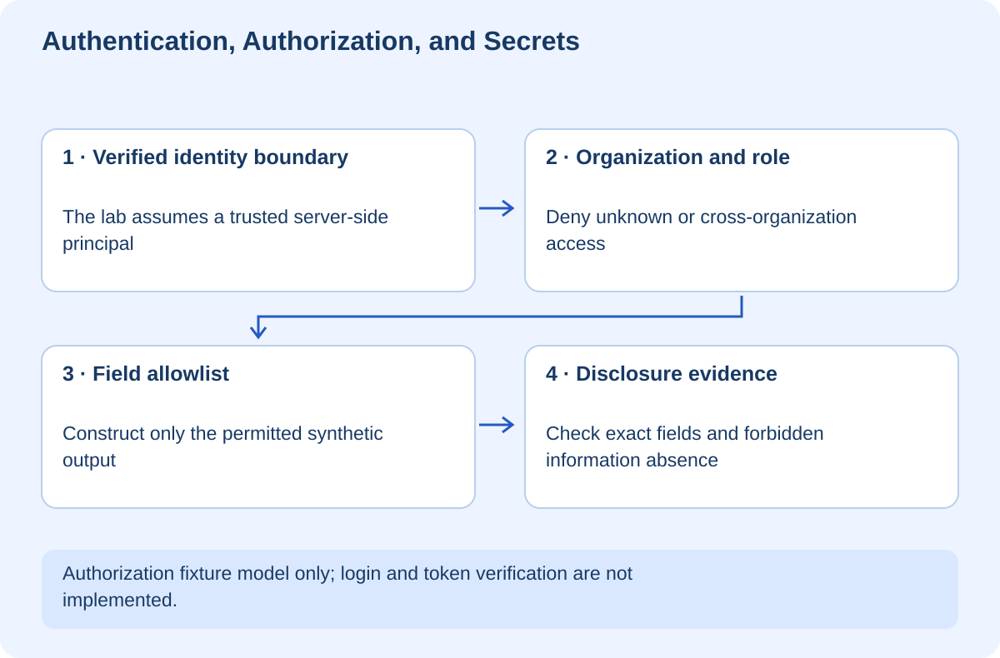

# Authentication, Authorization, and Secrets

## At a glance

This workshop separates three ideas often blurred together: proving who a caller is, deciding what that caller may do, and protecting credentials used by software. A synthetic HarborCare scenario shows why a signed-in transport coordinator must not receive clinical notes merely because the API knows their identity.

The Python lab models authorization and field selection after authentication. It does not implement passwords, sessions, token verification, or an identity provider. Its principal objects are trusted fixtures standing in for server-verified identities. Never accept equivalent objects directly from an untrusted client.

## Lesson 1 — Knowing a name is not granting access

Authentication answers “Who is this caller?” Authorization answers “May this caller perform this operation on this resource?” A user can pass the first check and fail the second. A session cookie or token is evidence the server must validate, not a magical permission to access everything.

In our scenario, care staff and transport staff belong to the same synthetic hospital. Care staff may see a clinical note; transport staff may see only the case identifier and transport requirement. A caller from another organization receives nothing, even if their role is named `care`.

The diagram puts organization and role checks before disclosure. If you return the whole record and hide fields in the browser, the private data has already crossed the boundary. Authorization must govern the server response itself.

**Checkpoint:** Explain why adding a login screen does not fix an API that returns another organization's records.

## Lesson 2 — Run the permission matrix

Run `python lab.py` from the workshop's `exercises` folder. It evaluates missing identity, another organization, an unknown role, transport access, and care access.

Read `disclose()`. It returns a status and either no payload or an explicitly selected dictionary. The record contains an extra internal field that no role receives. The assertions check exact output keys, not just that a permitted key is present.

| Caller | Result |
|---|---|
| No verified principal | 401, no data |
| Principal in another organization | 403, no data |
| Unknown role | 403, no data |
| Transport staff in the organization | Case ID and transport only |
| Care staff in the organization | Case ID, transport, and clinical note |

Real systems sometimes return 404 to avoid revealing that a restricted resource exists. Choose a consistent policy based on your threat model. The lab's status choices make the teaching distinction visible.

## Lesson 3 — Allowlist fields and deny by default

The lab starts from a role-to-field allowlist. It constructs a fresh result containing only permitted fields. That is safer against accidental new-field disclosure than starting with the entire record and removing a few known secrets.

Add a synthetic `billing_note` to the record. Existing transport output should remain unchanged. Then test a new unknown role. It should be denied until the policy explicitly defines its permissions.

Permissions should be validated on every request, including direct API calls that bypass the user interface. Deny-by-default is a useful baseline, not a substitute for correctly defining the allowed cases. [OWASP authorization guidance](https://cheatsheetseries.owasp.org/cheatsheets/Authorization_Cheat_Sheet.html)

In a real service, resource ownership should come from trusted database state. Do not let the client provide an organization ID and then treat that assertion as proof of membership. Likewise, hiding an action button does not remove the need to authorize the corresponding endpoint.

## Lesson 4 — Understand sessions and tokens without inventing security

A login system usually establishes a server-recognized session or issues a token through a trusted identity flow. The server must validate the relevant evidence, including expiry and intended use. Decoding a token's payload is not the same as verifying it.

Use maintained authentication components appropriate to the framework rather than designing your own password cryptography or token format as a beginner. Learn their configuration, logout behavior, expiry, revocation options, and security boundaries. Do not copy a demonstration token into production.

Cookies and browser storage have different exposure and request behavior. Cookie-based sessions also require attention to cross-site request protections and cookie attributes. These decisions depend on the application architecture; this permission lab is intentionally not a complete login implementation.

**Checkpoint:** Identify the exact boundary where your real backend obtains its trusted principal. If the answer is “the frontend sends a user object,” investigate further.

## Lesson 5 — Treat secrets as capabilities

A secret such as a deploy token grants an ability. Store it outside source code, grant the narrowest practical access, limit who can retrieve it, and rotate or revoke it when exposure is suspected. Avoid logging secrets even when your platform offers masking.

Environment variables are a delivery mechanism, not an automatic security guarantee. A value included in a client bundle is public to the browser user. Do not expose a server credential through a public frontend configuration variable.

If a credential is committed, deleting it in a later commit is not enough: previous history or copies may retain it. Revoke or rotate the credential first, then follow the repository's incident and history-cleanup process. Do not paste the exposed value into an issue to explain the problem.

The workshop never reads your real environment or credentials. All sensitive-looking strings in the fixture are deliberately synthetic.

## Lesson 6 — Your independent challenge

Add an auditor role that may see a case ID and an audit summary but neither the transport details nor the clinical note. Write exact-field tests, cross-organization denial, and unknown-role denial before implementing it.

Then explain the limitations: a role alone may not express case assignment, purpose of use, time-limited access, or a consent rule. A production hospital system needs policies and professional review far beyond this synthetic teaching model. No legal compliance claim is made here.

Your completion evidence is the permission matrix, passing assertions, and a clear explanation of which authentication responsibilities are deliberately outside the lab. The correct takeaway is not “a dictionary makes my app secure”; it is “identity, resource access, and field disclosure are separate boundaries that need evidence.”
