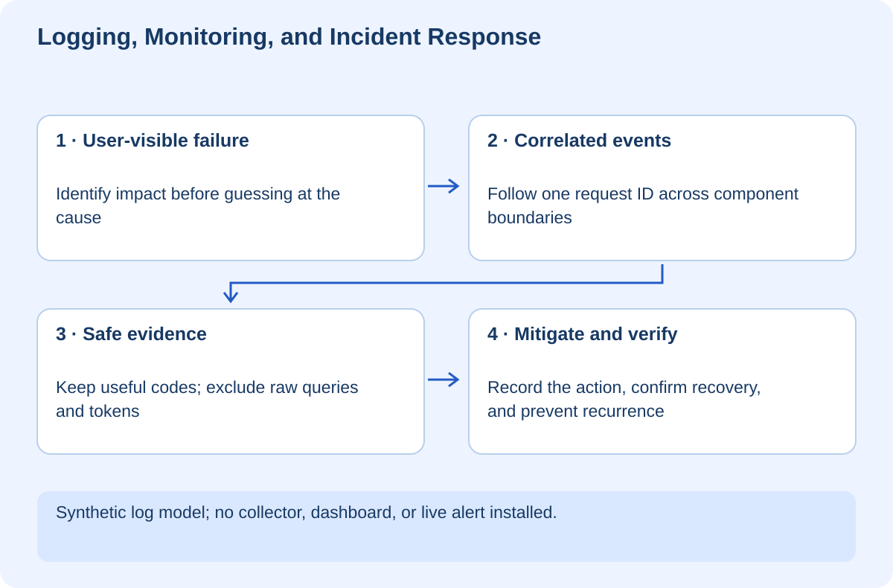

# Logging, Monitoring, and Incident Response

## At a glance

This workshop teaches you to answer “What happened?” without collecting every private detail or guessing from a generic error screen. You will connect synthetic events across a web layer and API, distinguish event logs from aggregate measurements, and rehearse an incident response that prioritizes restoring service while preserving evidence.

Run the Python lab in `exercises` with `python lab.py`. It creates only in-memory synthetic events. It does not install a telemetry collector, contact a monitoring vendor, or access your real application logs.

## Lesson 1 — Ask a question before collecting data

Imagine the learning website reports “Search failed.” You need to know whether this affects one request or everyone, when it started, and where the failure occurred. A stack trace alone may not answer those questions.

Logs describe events. Metrics summarize measurements such as request count, error rate, or latency. Traces connect operations across a request path. These signals complement each other rather than replacing each other. [OpenTelemetry's signal overview](https://opentelemetry.io/docs/concepts/signals/)

Start with operational questions: Can users complete search? How often does it fail? Which dependency is slow? What changed near the onset? Choose instrumentation that helps answer those questions, not a dashboard full of unrelated numbers.

## Lesson 2 — Follow a request without exposing its contents

The lab emits four events. Two different request IDs are interleaved. Filter for `req-A`: web start, API timeout, then web failure. The other request succeeded and should not be mistaken for a step in the failing chain.

The `emit()` function allowlists extra fields. Synthetic query and token values passed to it are deliberately excluded. This demonstrates data minimization: prevent unnecessary fields from entering the log instead of assuming someone will redact them later.

Request IDs are correlation aids, not authorization credentials. Do not allow an ID supplied by a client to grant access to another user's logs. A production system also needs access controls, retention, and an approach to identifiers that may themselves be sensitive.

**Checkpoint:** Explain why logging the entire request object can create a new incident while you investigate the first one.

## Lesson 3 — Count the right thing

The synthetic dataset contains one failed completed web request and one successful completed web request. The lab counts requests, not every error event. Counting both the API error and the web error as two failed user requests would inflate the result.

These two records are teaching data, not a measured availability claim about your website. A meaningful metric needs a defined denominator and time window. “Five errors” means something different out of ten requests than out of a million.

Latency also has a distribution. An average can hide a slow tail. When investigating real performance, examine appropriate percentiles and sample sizes, then distinguish application latency from dependency latency. Avoid assigning a performance target before understanding user needs and actual measurements.

## Lesson 4 — Respond to an incident in order

First establish impact and severity. Identify who is affected and whether there is an active safety or privacy risk. Stop harmful operations when necessary. Assign an incident owner and a communication channel so multiple people do not make conflicting changes.

Next gather a small timeline: last known good state, first observed failure, recent deployments or configuration changes, and the exact evidence. A nearby deployment is a hypothesis, not proof of causation.

Choose a bounded mitigation: roll back a known bad release, disable a risky feature, or reduce load if the evidence supports it. Record the action and verify its effect. A reverted code deployment does not reverse database writes or external agent actions.

After restoration, investigate the underlying cause and add prevention: a regression test, a better alert, safer rollout, or clearer operational procedure. A post-incident review should explain the system conditions rather than merely blaming the person who clicked deploy.

## Lesson 5 — Alerts need an action

An alert should tell an appropriate person that intervention may be needed. If every warning pages someone, people learn to ignore the noise. Distinguish informational events from symptoms that threaten the service objective.

For search, a sustained increase in failed requests may be more useful than an alert for one transient timeout. For an unauthorized disclosure, even one verified event may require immediate action. The threshold depends on the consequence, not a universal recipe.

Attach a short runbook: how to confirm impact, which dashboards or logs to inspect, which actions are safe, and when to escalate. Keep secrets out of runbooks and incident messages.

## Lesson 6 — Your independent challenge

Add a second failing dependency to the synthetic events. Reconstruct two separate request chains and compute user-request failures without double counting. Then remove one correlation ID and describe what becomes uncertain.

Write a one-page runbook for the learning website's search: symptom, scope check, recent-change check, mitigation options, verification, and communication. Do not claim an installed alert exists until it has actually been configured and tested.

The lab proves its filtering, allowlisted event fields, and synthetic counting logic. It does not prove production observability. You are finished when you can explain what evidence is available, what is missing, and what decision each signal supports.
