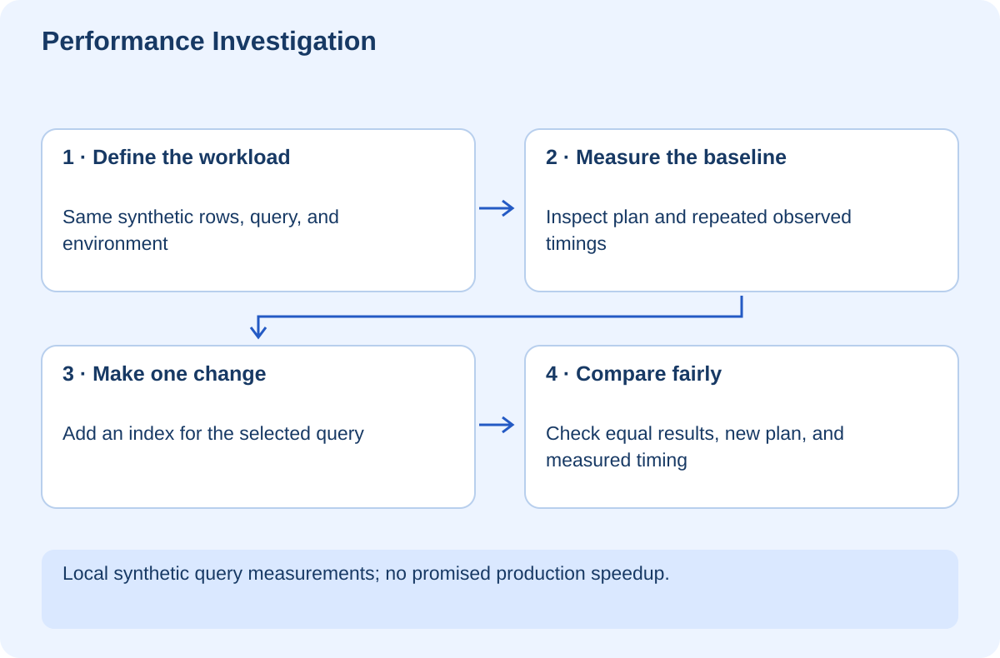

# Performance Investigation — Measure Before You Optimize

## At a glance

This workshop teaches you to turn “the app feels slow” into a measured, testable question. You will inspect a SQLite query plan, measure a controlled workload, add an index, and verify that the returned data remains the same. The script prints the timings observed on your machine; the course does not invent a speedup or require one fixed ratio.

Use Python 3.10 or newer. Run `python lab.py` from `exercises`. All 10,000 records are synthetic and the database is in memory. This is a query experiment, not a benchmark of the learning website or a production database.

## Lesson 1 — Define the symptom and workload

“Search is slow” could mean typing feels delayed, the HTTP request waits, the database scans many rows, or rendering freezes after the response. These are different bottlenecks. Measure the path before selecting a fix.

Write down the operation, input size, environment, baseline, and user-visible consequence. A query selecting a rare category is not the same workload as returning nearly every row. Data distribution matters, not just row count.

Our lab creates 10,000 lessons, with one percent in a rare category. The query selects that category and returns 100 rows. It measures the same operation repeatedly before and after adding an index.

**Checkpoint:** State what the lab measures and name three parts of a real website that it does not measure.

## Lesson 2 — Inspect the execution plan

An index is an additional data structure that can help the database locate relevant rows. It consumes storage and adds work when indexed values change. Creating one on every column is not a thoughtful performance strategy.

The lab asks SQLite for `EXPLAIN QUERY PLAN` before and after adding an index on category. Read the printed plan. The assertion checks that the intended index appears after the change. [SQLite's query-plan guide](https://sqlite.org/eqp.html)

The plan is evidence about the chosen access path, not a promised duration. A database may prefer a scan for some data distributions or small tables. Different engines and versions can choose different plans, so avoid brittle tests that require an entire plan string to match forever.

## Lesson 3 — Measure without pretending to eliminate noise

The script runs 21 samples for each version and takes the median of the last 20. The first sample is excluded to reduce one simple warmup effect. This does not control every source of noise or make the experiment a scientific universal claim.

Operating-system scheduling, caches, concurrent work, runtime version, and hardware can affect results. Compare like with like, repeat the measurement, and keep the observed values. Do not change the query, data, and hardware together and attribute the whole difference to one index.

The script does not assert that one timing must beat the other. It asserts equal results and intended index use, then prints timings for interpretation. A flaky performance assertion can distract from a real correctness regression.

**Checkpoint:** Explain why a measured value on your laptop is not a service-level guarantee for production users.

## Lesson 4 — Preserve correctness while changing speed

The lab compares result sets before and after the change. An optimization that drops records is not a successful optimization. Order is not guaranteed by this query, so the comparison sorts results for equivalence rather than relying on accidental database order.

In an application, also preserve authorization, freshness, and error behavior. A cache that serves another user's restricted answer quickly is a severe regression. Include user or permission scope in the cache design where required, and decide how changes invalidate cached data.

Do not introduce caching before identifying repeated work and defining acceptable staleness. The simplest correct query or a smaller response may solve the problem without a new cache invalidation system.

## Lesson 5 — Trace the full path when the query is not the bottleneck

If the database query is fast but the page remains slow, inspect the next boundary. Are you sending too much data? Rendering thousands of elements? Fetching the same collection repeatedly? Waiting for an external model call? Use the browser network and performance tools and server measurements to narrow the issue.

For RAG, separate retrieval latency, model latency, and output rendering. For an agent workflow, measure queued time separately from execution time. An average across all stages can hide the one users are actually waiting on.

Optimization has costs: complexity, memory, storage, maintenance, and sometimes consistency. Record the tradeoff alongside the measured benefit. A small speed gain may not justify a difficult architecture change.

## Lesson 6 — Your independent challenge

Change the workload to query the common category, then rerun the experiment. Predict why the index may be less helpful when most rows match. Keep the result-equivalence assertion.

Next add a real user-facing budget for a small local operation and explain the environment where you measured it. Do not copy arbitrary performance targets from another project without checking whether they fit the user's needs.

Your handoff should include the original symptom, workload, before/after plans, observed timings, correctness checks, and limitations. The supplied lab verifies result equivalence and index usage only; it makes no claim about live website performance.
