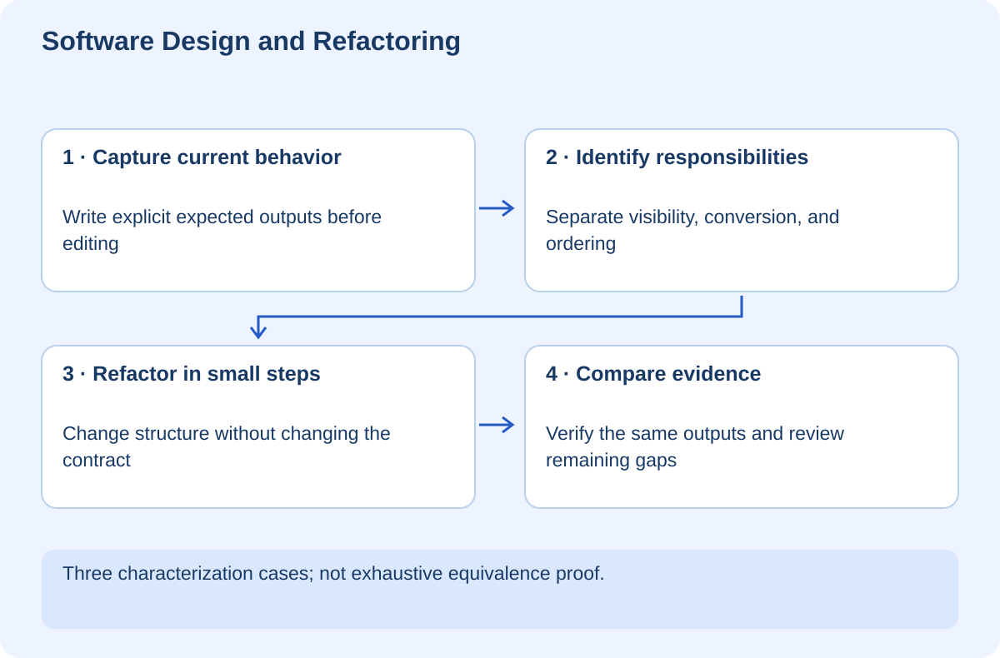

# Software Design and Refactoring Without Breaking Behavior

## At a glance

This workshop teaches you to improve code structure while preserving the behavior people already rely on. You will identify responsibilities in a small lesson-card function, capture current behavior with explicit examples, extract focused functions, and compare results before and after. The Python lab has no external dependencies or side effects.

Run `python lab.py` from `exercises`. It checks three explicit input/output cases against both implementations. Those examples are evidence for the sampled behavior, not a mathematical proof for every possible input.

## Lesson 1 — Distinguish a refactor from a feature change

A refactor changes internal structure while preserving externally observable behavior. A feature change deliberately changes behavior. They can happen near each other, but mixing them makes review and diagnosis harder.

Imagine a large function selects published lessons, cleans their labels, orders them, loads extra metadata, and renders HTML. If something breaks, every responsibility is tangled together. Separating concerns can make it easier to test a rule without starting the entire application.

But more files do not automatically mean better design. A one-line helper with no meaningful name or boundary may only force readers to jump around. Look for a responsibility that can be explained in one sentence and has a stable reason to change.

**Checkpoint:** Identify a change that is not a refactor even if it makes the code “cleaner.” Changing sort order is one example.

## Lesson 2 — Capture behavior before improving structure

The lab's legacy function filters active items, trims titles, and sorts cards by ID. Its explicit cases cover empty input, a hidden item, and ordering of visible items. The expected outputs are written directly rather than computed by another copy of the algorithm.

These are characterization tests: they describe behavior that already exists. Some existing behavior may be undesirable, but changing it should be a separate decision. Otherwise a refactor becomes an unreviewed product redesign.

Read the expected list before reading the extracted functions. Can you explain the contract without implementation jargon? “Inactive items are absent; labels have surrounding spaces removed; visible cards are ordered by ID.” That is a useful review description.

## Lesson 3 — Extract responsibilities, not arbitrary lines

`is_visible` answers the selection question. `to_card` converts a record into its display shape. `refactored` combines these and retains the same ordering. The names express intent, while the composition still makes the data flow visible.

This is deliberately modest. There is no need for a plugin framework, inheritance hierarchy, or generic pipeline engine to clean up three operations. Introduce abstraction when it reduces a real maintenance burden, not because a diagram looks impressive.

For your agent projects, useful boundaries include authorization, retrieval, tool execution, and response formatting. They often have different tests and failure modes. A model prompt should not silently own the authorization rule simply because both occur in the same function today.

**Checkpoint:** Explain which function changes if the display label rule changes and which changes if the visibility rule changes.

## Lesson 4 — Keep dependencies pointing toward stable rules

Business rules should be testable without dragging in a web server, database connection, or model API whenever practical. Pass required collaborators at a clear boundary. This is dependency injection in plain terms: give the function the capability it needs rather than letting it find hidden global state.

The testing workshop injected a move adapter. The same idea applies here: a service can use a storage interface while the rule remains independently testable. However, excessive interfaces for trivial code can increase complexity. Let actual variation and testing needs justify the boundary.

Watch for hidden coupling: a function that mutates its input, changes a global counter, or reads the current time has more behavior than its return value suggests. Preserve or deliberately change those effects with tests.

## Lesson 5 — Review the change in small steps

Start from a clean baseline and run tests. Make one extraction, rerun relevant tests, and inspect the diff. Avoid simultaneously renaming every file, changing formatting, and updating dependencies. A reviewer should be able to see that the intended behavior remains intact.

If a test fails, do not immediately rewrite the expected value. Compare the before-and-after behavior and decide whether the refactor changed something unintentionally. Examples cannot cover everything, so add tests for newly discovered edge cases.

Performance is also observable behavior when it materially affects users. A refactor that turns one database query into hundreds may preserve small fixture outputs while harming production. Review dependency calls and measure where needed.

## Lesson 6 — Your independent challenge

Add a characterization case with a title containing only spaces and another with repeated IDs. Describe the current output before deciding whether those inputs should be accepted. Then extract validation as a separate feature change with new requirements and tests.

For a real project, choose one long function and write a responsibility map. Propose the smallest useful boundary, the tests that protect it, and what you will intentionally leave alone.

The verified lab demonstrates equivalent results for three specified cases. It does not prove whole-project architecture quality or exhaustive equivalence. You are finished when you can explain why the new structure makes a future change easier without claiming that “more modular” is automatically better.
