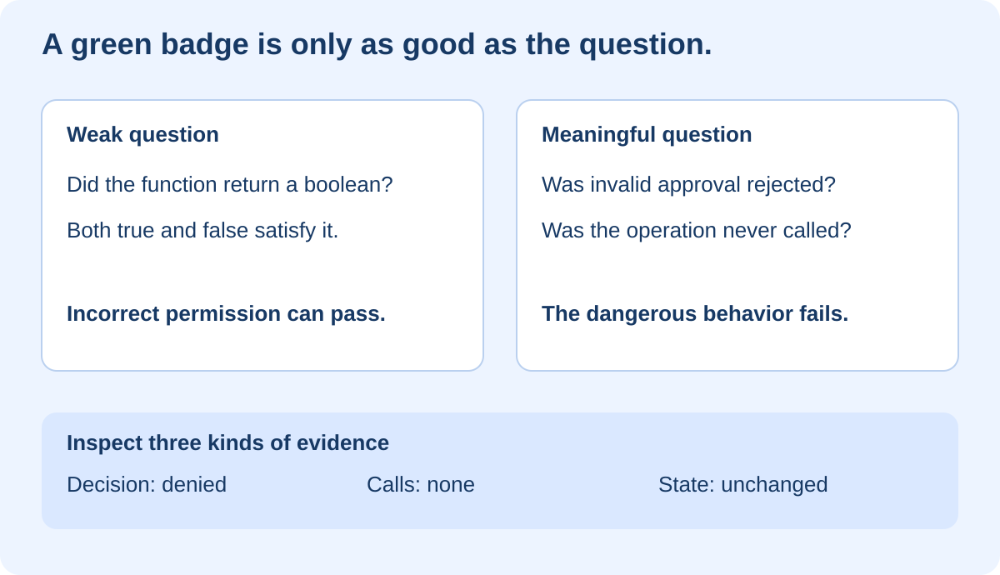
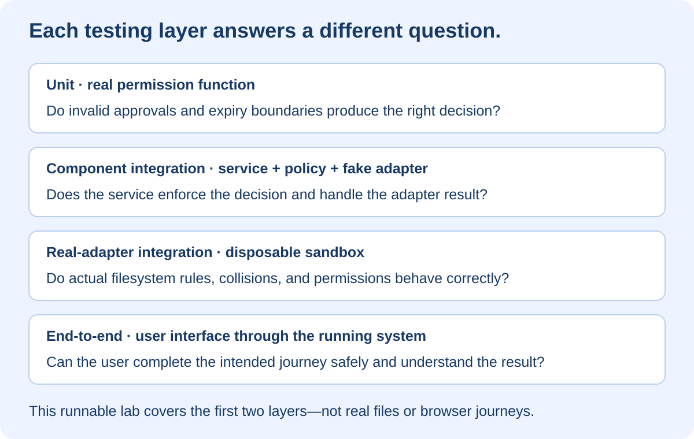

# Testing That Catches Real Problems

## At a glance

This eight-lesson workshop teaches you to write tests that protect meaningful behavior rather than merely produce green badges. You will test a miniature FilePilot-style approval service, compare a weak test with stronger assertions, isolate dependencies, check failure paths, and deliberately break corrected code to see whether the suite notices. It connects debugging to CI/CD: discover a problem, preserve the discovery as a test, and make that test part of the release gate.

You need Node.js 22 or newer and PowerShell. The exercise uses built-in Node modules only. No package installation, account, cloud service, database, or real file operation is required. All filenames and approvals are synthetic fixtures. The lab is not the production FilePilot implementation and is not a complete authorization system.

> **The key idea:** A passing test means its assertions were satisfied. It does not mean the feature is complete, secure, or correct in every situation. Ask: “What wrong behavior would make this test fail?”

## Lesson 1 — Turn a promise into observable evidence



### What the diagram teaches

Imagine FilePilot proposes moving a document from an inbox to an archive. The user must approve the specific plan before it executes. Someone writes a test that checks whether the permission function returns a boolean. It passes. But the function accepts the string `"false"` as approval because a nonempty string is truthy in JavaScript.

The test asked a technically valid but insufficient question. It checked the shape of the answer, not whether the decision was right. A better test says: “When approval is the text `false`, the result must be false.” A stronger service-level check adds: “The move adapter must not be called.”

A denied response alone is not enough. Imagine a service that performs the move and then returns `denied`. The screen would appear reassuring while the side effect had already happened. Good tests inspect both the response and the relevant side effect.

### Our deliberately small contract

For this teaching model, approval is valid only when all three conditions hold:

1. `approved` is the actual boolean `true`, not a string or another truthy value.
2. The approval belongs to the same plan ID.
3. The current time is strictly before the expiry time. At the exact expiry instant, approval is no longer valid.

The service must not call its move adapter when permission is denied. When allowed, it must await the adapter and report completion only after success. An adapter error must propagate rather than becoming a false success.

These rules are explicit assumptions for the workshop. A real system additionally needs authenticated approvers, trusted approval storage, authorization, immutable plan contents, replay protection, durable records, path safety, and recovery. A caller-supplied `approved: true` object is not a security credential.

**Checkpoint:** Write one positive assertion and one “must never happen” assertion for a feature you own.

## Lesson 2 — Run the misleading green test

Copy the starter to a new practice directory. Do not overwrite an earlier exercise:

```powershell
if (Test-Path -LiteralPath E:\testing-lab) {
    throw 'Choose a new practice folder first.'
}
Copy-Item -LiteralPath E:\image-course\docs\training\testing\exercises\testing-lab -Destination E:\testing-lab -Recurse
Set-Location E:\testing-lab
npm run test:weak
npm test
```

There are no dependencies to install. The first command runs one intentionally weak test; the second runs the meaningful suite. Expected starting results:

```text
Weak example:       1 passes, 0 fail
Meaningful suite:   8 pass,   3 fail
```

### Understand the file structure

```text
testing-lab/
├── package.json              Commands; no external dependencies
├── policy.mjs                Permission decision and execution service
└── tests/
    ├── fixtures.mjs          Fresh synthetic inputs for each test
    ├── weak.example.mjs      A demonstration of false confidence
    └── policy.test.mjs       Eleven behavior and component checks
```

`mayExecute` decides whether the approval satisfies the small contract. `executePlan` calls that policy before invoking an injected `move` function. The production filesystem is not imported. In this lab the adapter is a function supplied by each test.

Read the weak test:

```javascript
approval.approved = 'false';
assert.equal(typeof mayExecute(plan, approval, now), 'boolean');
```

It accepts both `true` and `false` as results. That means an incorrect permission decision can satisfy it. The problem is the assertion—not the test runner.

Change your question from “Did it return a boolean?” to “Did it reject this invalid approval?” Before looking at the supplied strong test, write the assertion yourself.

**Checkpoint:** Explain why adding more tests with equally weak assertions would not solve the problem.

## Lesson 3 — Write a precise unit test

A unit test checks a small behavior in isolation. Here we can call the permission function directly without starting a browser or server.

Use the pattern **Arrange → Act → Assert**:

```javascript
test('text false is not approval', () => {
  // Arrange: create known inputs and the case we want to investigate.
  const { plan, approval, now } = fixture();
  approval.approved = 'false';

  // Act: exercise the real decision code.
  const allowed = mayExecute(plan, approval, now);

  // Assert: compare with the requirement, not another implementation.
  assert.equal(allowed, false);
});
```

`fixture()` creates fresh objects every time. If tests share and mutate one approval object, the result can depend on execution order. A fixture is controlled starting data, not an elaborate hidden scenario you cannot explain.

Do not compute the expected value by copying the production expression into the test. If both expressions have the same mistake, the test agrees with the bug. Derive expected values from the stated contract.

### Read the initial failure

The starter uses `approval.approved && ...`. The text `false` is a nonempty string, so it passes this truthiness check. The final `Boolean(...)` converts the combined expression to a boolean but does not make the earlier approval interpretation correct.

In `policy.mjs`, change:

```javascript
approval.approved &&
```

to:

```javascript
approval.approved === true &&
```

Run `npm test`. Ten tests should pass and one should fail. The exact-expiry rule is still broken. The weak test also still passes; it could not distinguish the original behavior from the corrected behavior.

### Design a case matrix

| Situation | Expected decision | Reason |
|---|---|---|
| Boolean true, matching plan, before expiry | Allow | All requirements satisfied |
| Boolean false | Deny | User did not approve |
| Text `"false"` | Deny | Wrong type, not a valid approval |
| Missing approval | Deny | No authorization evidence |
| Approval for another plan | Deny | Approval is scoped to a different action |
| After expiry | Deny | Approval is no longer valid |
| Exactly at expiry | Deny | Validity ends at this instant |

The suite samples this contract; it does not enumerate every possible JavaScript value. Add cases based on risk, and validate untrusted input at the real application's boundary.

**Checkpoint:** Add a test rejecting the string `"true"`. Predict whether the current corrected implementation will pass it before running it.

## Lesson 4 — Test boundaries without waiting for the clock

The lab passes `now` into the function instead of calling the wall clock internally. That makes the time scenario explicit and repeatable. You do not have to wait for an approval to expire or race against a millisecond boundary.

The fixture uses an expiry of 2000. Compare current times 1999, 2000, and 2001. These are synthetic numeric time units, not meaningful dates. The rule is `now < expiresAt`.

The starter incorrectly uses:

```javascript
approval.expiresAt >= now
```

Change it to:

```javascript
approval.expiresAt > now
```

Run the supplied suite again. All eleven tests should pass. If you added your own extra tests, your total will be higher.

The lesson is not that strict comparison is always right. Another product could define an inclusive boundary. The important part is to decide the contract first and test the boundary explicitly.

### What makes a test flaky?

A flaky test passes and fails without an intended code change. Common causes include uncontrolled time, shared state, random inputs without a recorded seed, live external services, and assumptions about execution order. Adding retries can hide the evidence without fixing the cause.

Use fresh fixtures, deterministic inputs, isolated resources, and awaited asynchronous operations. For UI tests, wait for meaningful conditions rather than sleeping an arbitrary number of seconds. Playwright's assertions can retry until the expected condition is met within a timeout. That reduces timing assumptions; it does not make every test automatically reliable. [Playwright assertions](https://playwright.dev/docs/test-assertions)

**Checkpoint:** Explain why checking 1999, 2000, and 2001 is more informative than checking three unrelated times far before expiry.

## Lesson 5 — Verify that denied work never happens



### What the diagram teaches

A correct permission function is necessary, but another function might forget to call it. That is why the service needs its own tests. The test should exercise the real service and real permission function while replacing only the dangerous external operation.

Here is the essential denial check:

```javascript
const calls = [];
const result = await executePlan(plan, approval, {
  now,
  move: async (...args) => calls.push(args)
});
assert.deepEqual(
  { result, calls },
  { result: { status: 'denied' }, calls: [] }
);
```

The supplied test sets `approval.approved` to the string `false` first. The `calls` array acts as a spy: it records invocations so you can inspect whether the operation was attempted. No actual file is touched.

### Test doubles in plain English

| Term | Purpose in a test | Example |
|---|---|---|
| Stub | Supplies a controlled response | An adapter that always throws a simulated error |
| Spy | Records calls for assertions | The `calls` array above |
| Fake | A simplified working implementation | A Map that models moving a named item |
| Mock | Commonly, a double with configured expectations | Expect exactly one call with specific arguments |

Terminology varies between libraries. Focus on what you replaced and what evidence that replacement can provide. Node has built-in testing and mocking facilities; this workshop uses simple functions so the mechanics stay visible. [Node test runner reference](https://nodejs.org/download/release/v22.15.0/docs/api/test.html)

Do not replace `mayExecute` with a stub returning false in the very test intended to prove that real approval validation works. You would test a behavior you invented inside the test rather than the policy you plan to ship.

### Asynchronous failure is part of the contract

The adapter can fail. The supplied test uses `await assert.rejects(...)` and an adapter that throws `simulated adapter failure`. It checks that the service does not report completion after failure.

The `await` matters. A test that starts an asynchronous action and finishes before checking its result may provide misleading evidence or produce later unhandled failures. Always ensure the runner waits for the behavior being asserted.

**Checkpoint:** Explain why “result is denied” and “adapter was never called” are separate assertions worth protecting.

## Lesson 6 — Know what integration and browser tests add

The final supplied test combines the real policy, the real execution service, and an in-memory adapter. The adapter models a transfer in a Map. It rejects a missing source or occupied destination, moves the synthetic content, and records the call.

The test checks the completed result, exact source and destination, one invocation, absence of the original Map entry, and the content at the destination. This is a **component integration test with a fake adapter**. It is not a filesystem integration test, an HTTP test, or an end-to-end browser test.

### What remains unproven

Real filesystems involve permissions, collisions, locks, symbolic links, junctions, platform-specific path rules, partial failures, and races. A Map models none of these. Before shipping a real adapter, test it in an explicitly created disposable sandbox, with validated paths and deliberate recovery behavior. Never run a destructive training test against your Downloads folder or home directory.

A browser test adds another boundary: can the user actually submit an approval and understand the outcome? A proposed FilePilot journey would open a synthetic proposal, decline it, attempt execution through the service boundary, and confirm no action record exists. Merely seeing a disabled button does not prove that the server rejects unauthorized requests.

For your existing learning website, a simpler browser journey is: search for FilePilot, open the correct article, and verify its title. Prefer user-visible roles and labels over fragile selectors tied to layout. [Playwright testing practices](https://playwright.dev/docs/best-practices)

Browser automation is described here as the next layer; this dependency-free lab does not include a browser app or claim to have run an end-to-end suite. Its runnable exercises focus on assertions, boundaries, and safe test doubles.

### Choose layers according to the risk

Use fast focused tests for many rule combinations, integration tests for boundaries between components, and a smaller set of important full journeys. There is no magic percentage split that makes every project good. The expensive failure modes of your project should influence what you test.

**Checkpoint:** Name one defect each layer could catch that the other layers in this lab would miss.

## Lesson 7 — Test the tests

Once everything is green, ask whether it would notice a meaningful regression. **Mutation testing** deliberately changes behavior and checks whether tests fail. You can perform a small version manually without installing a mutation-testing framework.

Keep the corrected version available. Make one temporary change at a time in your disposable practice copy, run `npm test`, observe the intended assertion failure, and restore the correct code:

1. Replace strict boolean approval with the original truthiness check.
2. Replace strict expiry with the original inclusive comparison.
3. Temporarily replace the matching-plan expression with `true`.

The meaningful suite should detect all three. A syntax error is not useful proof here: the mutant should still run and fail because its behavior violates a requirement. The accompanying verification script checks these three deliberate regressions in a temporary copy; it does not alter your starter.

### Coverage is a clue, not a verdict

Coverage tells you which code was executed under measurement. It does not tell you whether the assertion is meaningful. The weak test can execute the permission expression and still accept an incorrect result. Conversely, an uncovered branch might be critical validation that deserves immediate attention.

Use coverage to ask better questions, not to replace them. Likewise, detecting three selected mutations is evidence about three faults, not a comprehensive mutation score or a security certification.

### Maintain readable tests

Name the behavior being protected. Keep expected values close to the assertion. Avoid giant setup helpers that hide why a case is valid or invalid. Refactor repeated preparation only when it remains obvious what each test is arranging.

**Checkpoint:** Introduce a new valid-JavaScript bug and predict which named test should catch it. If none does, add a meaningful test before claiming your suite protects that behavior.

## Lesson 8 — Put the evidence into your delivery workflow

The CI/CD course taught you to make a quality check required. This workshop teaches you what belongs inside it. In this dependency-free lab, `npm test` is the command that runs the meaningful suite. Keep `test:weak` as a teaching demonstration, not as your release gate.

For a larger project, install its locked dependencies, run the appropriate build and verification commands, then run relevant tests. Do not introduce a required check before establishing its baseline. Do not silence a failure with `continue-on-error` simply to make merging possible.

When CI fails, read the named assertion. Is the implementation wrong, the expected behavior outdated, or the test setup invalid? A changed requirement may justify changing a test, but that decision should be explicit and reviewed. Deleting an inconvenient test is not a fix.

### Your independent challenge

Our approvals bind only a plan ID. Suppose the source or destination changes while the ID stays the same. The lab does not detect that change.

Design a stronger teaching contract that binds approval to a plan version or digest of its immutable action fields. First write a test where an approved destination is replaced with another destination. Require rejection and zero adapter calls. Then implement the new check and add a matching unchanged-plan success case.

Do not mistake a digest for authentication: a malicious caller who can fabricate both plan and approval can fabricate matching fields too. The real system must obtain approvals from a trusted source associated with an authorized user. This challenge explores binding semantics only; it is intentionally not solved in the starter.

### Apply the same thinking elsewhere

| Project | Weak evidence | Stronger evidence |
|---|---|---|
| RAG | An answer was returned | Retrieved evidence belongs to the user's allowed document set |
| HarborCare | Response has a patient object | Recipient receives exactly the permitted synthetic fields and no forbidden fields |
| MCP | Tool returns JSON | Unauthorized caller cannot reach the restricted handler |
| A2A | Task reports success | Duplicate task delivery does not duplicate a side effect |
| Learning library | Search box exists | Known query opens the intended article |

These are example test contracts, not claims that those systems have already implemented the protections. For model-driven features, separate deterministic authorization checks from variable answer-quality evaluations. A favorable model response on one run is not a permission boundary.

## Pocket legend and completion checklist

| Term | Plain-English meaning |
|---|---|
| Assertion | An executable statement of what must be true |
| Fixture | Known starting data for a test |
| Unit test | Focused check of a small behavior |
| Integration test | Check that selected components work together |
| End-to-end test | Check of a journey across the intended running stack |
| Test double | Controlled replacement for a dependency |
| Regression | A previously working behavior becoming broken again |
| Mutation | A deliberate behavior change used to challenge tests |
| Coverage | Measurement of code execution during tests |
| Flaky test | A check whose outcome varies for unintended reasons |

You have completed the workshop when you can explain why the weak test passes, fix both defects, demonstrate the forbidden-side-effect assertion, describe the fake adapter's limitations, and show a deliberate regression being caught.

The corrected supplied suite has eleven passing tests. The starter is intentionally left broken for your practice. Both diagrams are embedded in the HTML edition. No live project settings, real files, or cloud deployments are changed by the exercise. References were checked on 27 August 2026.
